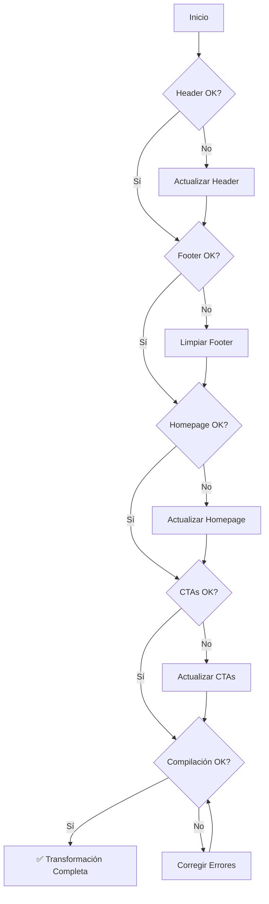

# Design Document: B2B Website Transformation

## Overview

Este documento detalla el diseño técnico para completar la transformación del sitio web de iKiwi a una orientación exclusivamente B2B. Basado en el análisis del código actual, muchos cambios ya están implementados. Este diseño se enfoca en verificar el estado actual y completar cualquier cambio pendiente.

## Architecture

### Estado Actual del Código

Basado en el análisis realizado:

| Componente | Estado | Notas |
|------------|--------|-------|
| Header (navegación) | ✅ Completo | Solo 5 enlaces, CTA "Trabajá con Nosotros" |
| Footer | ✅ Parcial | Recursos limpio, verificar sección Contacto |
| Homepage (page.tsx) | ✅ Completo | Sin NutritionHook ni RecipesHook |
| ContactHook | ✅ Completo | Grid B2B, certificaciones, WhatsApp/Email |
| Contacto page | ✅ Completo | 3 categorías B2B |
| final-cta.tsx | ✅ Completo | "CONTACTO COMERCIAL" |
| cta-wow.tsx | ✅ Completo | "CONTACTO COMERCIAL" |
| productos/page.tsx | ⚠️ Verificar | Revisar CTAs |
| nutricion/page.tsx | ⚠️ Verificar | Actualizar CTAs por consistencia |

### Componentes Afectados

```
src/
├── components/
│   └── layout/
│       ├── header.tsx              # ✅ Ya actualizado
│       └── footer.tsx              # ⚠️ Verificar sección contacto
├── app/
│   ├── page.tsx                    # ✅ Ya actualizado
│   ├── productos/page.tsx          # ⚠️ Verificar CTAs
│   └── nutricion/page.tsx          # ⚠️ Actualizar CTAs
└── components/sections/
    ├── contact-hook.tsx            # ✅ Ya actualizado
    ├── final-cta.tsx               # ✅ Ya actualizado
    └── cta-wow.tsx                 # ✅ Ya actualizado
```

## Components and Interfaces

### 1. Header Component (`src/components/layout/header.tsx`)

**Estado: ✅ COMPLETO**

El header ya tiene la configuración correcta:

```typescript
const navigation = [
  { name: "Inicio", href: "/", icon: "🏠" },
  { name: "Nuestros Kiwis", href: "/productos", icon: "🥝" },
  { name: "Nosotros", href: "/nosotros", icon: "👨‍🌾" },
  { name: "Noticias", href: "/noticias", icon: "📰" },
  { name: "Contacto", href: "/contacto", icon: "✉️" },
];
```

- ✅ 5 enlaces de navegación
- ✅ Sin Nutrición ni Recetas
- ✅ CTA único "Trabajá con Nosotros" en todas las vistas
- ✅ Icono Briefcase en lugar de ShoppingBag

### 2. Footer Component (`src/components/layout/footer.tsx`)

**Estado: ⚠️ VERIFICAR**

Configuración actual de footerLinks:

```typescript
// Recursos - YA LIMPIO
recursos: [
  { name: "Noticias", href: "/noticias" },
  { name: "Preguntas Frecuentes", href: "/faq" },
],

// Contacto - YA LIMPIO
contacto: [
  { name: "Contacto", href: "/contacto" },
  { name: "Contacto Comercial B2B", href: "/contacto#exportadores" },
  { name: "Exportadores", href: "/contacto#exportadores" },
],
```

**Verificación necesaria:**
- Confirmar que no hay enlaces a Recetas o Nutrición
- Confirmar que no hay "Dónde Comprar"

### 3. Homepage (`src/app/page.tsx`)

**Estado: ✅ COMPLETO**

```typescript
export default function Home() {
  return (
    <>
      <HeroStorytelling />
      <ProductsHook />
      <AboutHook />
      <NewsHook />
      <ContactHook />
      <CareersHook />
      <FinalCTA />
    </>
  );
}
```

- ✅ Sin NutritionHook
- ✅ Sin RecipesHook
- ✅ Flujo visual coherente

### 4. ContactHook (`src/components/sections/contact-hook.tsx`)

**Estado: ✅ COMPLETO**

Ya implementado con:
- ✅ Grid de 8 tipos de clientes B2B
- ✅ Card central "Contacto Comercial"
- ✅ Botones WhatsApp y Email
- ✅ Certificaciones (IG, GlobalGAP, USDA, UE)

### 5. Página de Contacto (`src/app/contacto/page.tsx`)

**Estado: ✅ COMPLETO**

Ya implementado con 3 categorías:

```typescript
const contactOptions = [
  {
    id: "gastronomia",
    title: "Gastronomía",
    description: "Restaurantes, cafeterías, panaderías y heladerías",
  },
  {
    id: "distribucion",
    title: "Distribución",
    description: "Supermercados, mayoristas y verdulerías",
  },
  {
    id: "exportacion",
    title: "Exportación",
    description: "Importadores internacionales y comercio exterior",
  },
];
```

### 6. CTAs en Componentes

#### final-cta.tsx - **Estado: ✅ COMPLETO**

```tsx
<Button asChild size="lg" className="...">
  <Link href="/contacto#exportadores">CONTACTO COMERCIAL</Link>
</Button>
```

#### cta-wow.tsx - **Estado: ✅ COMPLETO**

```tsx
<Button asChild size="lg" className="...">
  <Link href="/contacto#exportadores">CONTACTO COMERCIAL</Link>
</Button>
```

### 7. Página de Productos (`src/app/productos/page.tsx`)

**Estado: ⚠️ VERIFICAR**

Necesita revisión para confirmar que:
- No hay CTAs "Dónde Comprar"
- Los CTAs están orientados a contacto comercial

### 8. Página de Nutrición (`src/app/nutricion/page.tsx`)

**Estado: ⚠️ VERIFICAR**

Por consistencia, si la página tiene CTAs, deben ser "Contacto Comercial" en lugar de "Dónde Comprar".

## Data Models

No se requieren cambios en modelos de datos. Los cambios son puramente en la capa de presentación.

## Error Handling

### Consideraciones

1. **Enlaces Directos**: Las páginas `/nutricion` y `/recetas` seguirán siendo accesibles directamente por URL.

2. **Imports No Utilizados**: Verificar que no queden imports de componentes eliminados.

3. **Compilación**: Ejecutar verificación de diagnósticos después de cada cambio.

## Testing Strategy

### Verificación Manual

1. **Header**:
   - Desktop (xl+): 5 enlaces, CTA "Trabajá con Nosotros"
   - Tablet (lg): CTA "Trabajá" con icono Briefcase
   - Móvil: Menú sin Nutrición/Recetas, CTA actualizado

2. **Footer**:
   - Sección Recursos: Solo Noticias y FAQ
   - Sección Contacto: Sin "Dónde Comprar"

3. **Homepage**:
   - Sin secciones de Nutrición y Recetas
   - Flujo visual coherente

4. **CTAs en todo el sitio**:
   - Ningún "Dónde Comprar" visible
   - Todos dicen "Contacto Comercial" o similar

5. **Acceso Directo**:
   - `/nutricion` accesible por URL
   - `/recetas` accesible por URL

### Breakpoints a Verificar

- Mobile: < 1024px (lg)
- Tablet: 1024px - 1279px (lg to xl)
- Desktop: >= 1280px (xl+)

## Diagrama de Flujo de Verificación



## Resumen de Acciones

| Prioridad | Archivo | Acción |
|-----------|---------|--------|
| 1 | footer.tsx | Verificar que no hay enlaces B2C |
| 2 | productos/page.tsx | Verificar CTAs |
| 3 | nutricion/page.tsx | Actualizar CTAs por consistencia |
| 4 | Todos | Verificar compilación sin errores |
| 5 | Todos | Verificar imports no utilizados |

