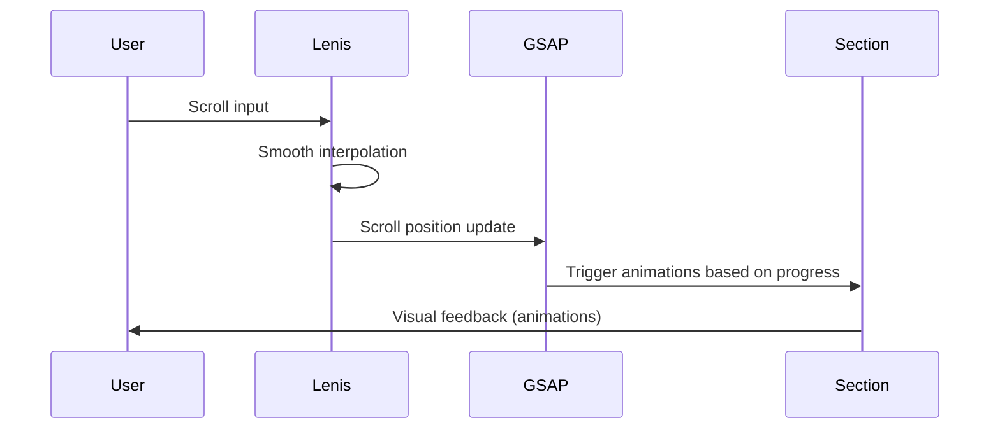

# Design Document: Homepage Storytelling Redesign

## Overview

Este documento detalla la arquitectura técnica y el diseño visual para transformar el homepage de Ikiwi en una experiencia de storytelling inmersiva. El diseño se inspira en "Corn Revolution" de Pioneer, adaptando sus principios de narrativa vertical, tipografía expresiva y transiciones fluidas al contexto del kiwi argentino.

La implementación utilizará el stack existente (Next.js, React, Tailwind CSS) complementado con GSAP ScrollTrigger para animaciones basadas en scroll y Lenis para smooth scrolling.

## Architecture

### Stack Tecnológico

```
┌─────────────────────────────────────────────────────────────┐
│                      Next.js App Router                      │
├─────────────────────────────────────────────────────────────┤
│  Layout (Lenis Provider)                                     │
│  ├── Header (existente)                                      │
│  ├── Homepage                                                │
│  │   ├── HeroStorytelling                                   │
│  │   ├── ProductsHook                                       │
│  │   ├── AboutHook                                          │
│  │   ├── NutritionHook                                      │
│  │   ├── RecipesHook                                        │
│  │   ├── NewsHook                                           │
│  │   ├── ContactHook                                        │
│  │   ├── CareersHook                                        │
│  │   └── FinalCTA                                           │
│  └── Footer (existente)                                      │
├─────────────────────────────────────────────────────────────┤
│  Shared Components                                           │
│  ├── ScrollReveal (wrapper para animaciones)                │
│  ├── SectionTransition (ondas/gradientes entre secciones)   │
│  ├── AnimatedTitle (tipografía con reveal)                  │
│  └── ParallaxImage (imágenes con efecto parallax)           │
├─────────────────────────────────────────────────────────────┤
│  Animation Layer                                             │
│  ├── GSAP + ScrollTrigger                                   │
│  └── Lenis (smooth scroll)                                  │
└─────────────────────────────────────────────────────────────┘
```

### Flujo de Scroll y Animaciones



## Components and Interfaces

### 1. LenisProvider

Componente wrapper que inicializa Lenis para smooth scrolling global.

```typescript
// src/components/providers/lenis-provider.tsx
interface LenisProviderProps {
  children: React.ReactNode;
  options?: {
    duration?: number;      // default: 1.2
    easing?: (t: number) => number;
    smoothWheel?: boolean;  // default: true
  };
}
```

### 2. ScrollReveal

Componente wrapper que aplica animaciones de entrada basadas en scroll.

```typescript
// src/components/animations/scroll-reveal.tsx
interface ScrollRevealProps {
  children: React.ReactNode;
  animation: 'fadeUp' | 'fadeIn' | 'slideLeft' | 'slideRight' | 'scale' | 'splitText';
  delay?: number;           // delay en segundos
  duration?: number;        // duración en segundos
  threshold?: number;       // 0-1, cuánto del elemento debe ser visible
  stagger?: number;         // para animaciones de hijos
  once?: boolean;           // animar solo una vez
  className?: string;
}
```

### 3. AnimatedTitle

Componente para títulos con animación de revelado por caracteres o palabras.

```typescript
// src/components/animations/animated-title.tsx
interface AnimatedTitleProps {
  children: string;
  as?: 'h1' | 'h2' | 'h3';
  animation: 'chars' | 'words' | 'lines' | 'fadeUp';
  className?: string;
  delay?: number;
  stagger?: number;         // tiempo entre cada elemento
  splitBy?: 'chars' | 'words';
}
```

### 4. ParallaxImage

Componente para imágenes con efecto parallax basado en scroll.

```typescript
// src/components/animations/parallax-image.tsx
interface ParallaxImageProps {
  src: string;
  alt: string;
  speed?: number;           // -1 a 1, negativo = más lento que scroll
  className?: string;
  containerClassName?: string;
  fill?: boolean;
  priority?: boolean;
}
```

### 5. SectionTransition

Componente para transiciones visuales entre secciones.

```typescript
// src/components/animations/section-transition.tsx
interface SectionTransitionProps {
  variant: 'wave' | 'gradient' | 'diagonal' | 'organic';
  fromColor?: string;       // color de la sección anterior
  toColor?: string;         // color de la sección siguiente
  height?: number;          // altura de la transición en px
  flip?: boolean;           // invertir la dirección
  className?: string;
}
```

### 6. Secciones del Homepage

Cada sección sigue una estructura similar:

```typescript
// Estructura base de cada Section Hook
interface SectionHookProps {
  className?: string;
}

// Componentes de sección:
// - HeroStorytelling
// - ProductsHook
// - AboutHook
// - NutritionHook
// - RecipesHook
// - NewsHook
// - ContactHook
// - CareersHook
// - FinalCTA
```

## Data Models

### Configuración de Animaciones por Sección

```typescript
// src/lib/homepage-config.ts
interface SectionConfig {
  id: string;
  backgroundColor: string;
  titleAnimation: 'chars' | 'words' | 'fadeUp';
  parallaxSpeed: number;
  transitionTo: 'wave' | 'gradient' | 'diagonal' | 'organic';
}

const homepageSections: SectionConfig[] = [
  {
    id: 'hero',
    backgroundColor: 'transparent', // video background
    titleAnimation: 'chars',
    parallaxSpeed: 0.5,
    transitionTo: 'wave'
  },
  {
    id: 'products',
    backgroundColor: '#faf8f5',
    titleAnimation: 'words',
    parallaxSpeed: 0.3,
    transitionTo: 'organic'
  },
  // ... más secciones
];
```

### Paleta de Colores (del documento pioneer.md)

```typescript
// src/lib/colors.ts
const kiwiPalette = {
  canopy: '#3f7528',        // Verde logo - fondo principal, sombras
  glow: '#8DC54D',          // Pulpa iluminada - CTAs, hover states
  skin: '#B48243',          // Piel del fruto - elementos estructurales
  core: '#F2ECAE',          // Núcleo blanco - texto principal
  soil: '#1A3311',          // Tierra profunda - footer, profundidad
  cream: '#faf8f5',         // Fondo cremoso actual
  warmCream: '#f5f0e8',     // Variante más cálida
};
```

## Visual Design

### Estructura Visual del Homepage

```
┌─────────────────────────────────────────────────────────────┐
│ HERO (100vh)                                                │
│ ┌─────────────────────────────────────────────────────────┐ │
│ │  Video Background + Overlay #3f7528/40                  │ │
│ │                                                         │ │
│ │         K I W I                                         │ │
│ │      A R G E N T I N O                                  │ │
│ │                                                         │ │
│ │  [Subtítulo animado]                                    │ │
│ │                                                         │ │
│ │         ↓ Scroll indicator                              │ │
│ └─────────────────────────────────────────────────────────┘ │
│ ~~~~~~~~~~~~~ Wave Transition ~~~~~~~~~~~~~                 │
├─────────────────────────────────────────────────────────────┤
│ PRODUCTOS HOOK (80vh)                                       │
│ ┌─────────────────────────────────────────────────────────┐ │
│ │  "NUESTROS"                                             │ │
│ │  "KIWIS"  ← Título grande, animado                      │ │
│ │                                                         │ │
│ │  [Card 1]  [Card 2]  [Card 3]                          │ │
│ │   Verde     Gold     Orgánico                          │ │
│ │                                                         │ │
│ │  [VER TODOS →]                                          │ │
│ └─────────────────────────────────────────────────────────┘ │
│ ═══════════ Gradient Transition ═══════════                 │
├─────────────────────────────────────────────────────────────┤
│ NOSOTROS HOOK (70vh)                                        │
│ ┌─────────────────────────────────────────────────────────┐ │
│ │  [Imagen Parallax Campo]     "DESDE"                    │ │
│ │                              "2006"                     │ │
│ │                                                         │ │
│ │                              La mayor productora...     │ │
│ │                              [NUESTRA HISTORIA →]       │ │
│ └─────────────────────────────────────────────────────────┘ │
│ ~~~~~~~~~~~~~ Wave Transition ~~~~~~~~~~~~~                 │
├─────────────────────────────────────────────────────────────┤
│ NUTRICIÓN HOOK (60vh) - Fondo #3f7528                       │
│ ┌─────────────────────────────────────────────────────────┐ │
│ │  "1 KIWI = 1 KILO DE LIMONES"                          │ │
│ │                                                         │ │
│ │  [Icon] 92mg    [Icon] 3g     [Icon] 61cal             │ │
│ │  Vit C          Fibra         Calorías                 │ │
│ │                                                         │ │
│ │  [DESCUBRÍ MÁS →]                                       │ │
│ └─────────────────────────────────────────────────────────┘ │
│ ═══════════ Organic Transition ═══════════                  │
├─────────────────────────────────────────────────────────────┤
│ RECETAS HOOK (70vh)                                         │
│ ┌─────────────────────────────────────────────────────────┐ │
│ │  "RECETAS"                                              │ │
│ │  "DELICIOSAS"                                           │ │
│ │                                                         │ │
│ │  [Img 1] [Img 2] [Img 3] [Img 4]                       │ │
│ │                                                         │ │
│ │  [VER RECETAS →]                                        │ │
│ └─────────────────────────────────────────────────────────┘ │
│ ~~~~~~~~~~~~~ Wave Transition ~~~~~~~~~~~~~                 │
├─────────────────────────────────────────────────────────────┤
│ NOTICIAS HOOK (50vh)                                        │
│ ┌─────────────────────────────────────────────────────────┐ │
│ │  "ÚLTIMAS NOTICIAS"                                     │ │
│ │                                                         │ │
│ │  [Noticia 1]  [Noticia 2]                              │ │
│ │                                                         │ │
│ │  [VER TODAS →]                                          │ │
│ └─────────────────────────────────────────────────────────┘ │
├─────────────────────────────────────────────────────────────┤
│ CONTACTO + TRABAJA HOOK (60vh)                              │
│ ┌─────────────────────────────────────────────────────────┐ │
│ │  "¿QUERÉS NUESTROS KIWIS?"    "SUMATE AL EQUIPO"       │ │
│ │                                                         │ │
│ │  [DÓNDE COMPRAR]              [TRABAJA CON NOSOTROS]   │ │
│ │  [CONTACTO B2B]                                         │ │
│ └─────────────────────────────────────────────────────────┘ │
├─────────────────────────────────────────────────────────────┤
│ FINAL CTA (40vh) - Fondo imagen campo atardecer            │
│ ┌─────────────────────────────────────────────────────────┐ │
│ │  "EL SABOR DEL"                                         │ │
│ │  "ATLÁNTICO SUR"                                        │ │
│ │                                                         │ │
│ │  [Badges certificaciones]                               │ │
│ └─────────────────────────────────────────────────────────┘ │
└─────────────────────────────────────────────────────────────┘
```

### Tipografía

Para lograr el efecto "Pioneer", necesitamos tipografía expresiva:

- **Títulos principales**: Fuente serif bold (Playfair Display o similar disponible en Google Fonts)
- **Subtítulos**: Geist Sans (existente) en peso medium
- **Cuerpo**: Geist Sans (existente)
- **Datos/Stats**: Geist Mono (existente) para números

### Animaciones Clave

#### Hero - Reveal de Título
```
Frame 0:    K _ _ _   A _ _ _ _ _ _ _ _
Frame 10:   K I _ _   A R _ _ _ _ _ _ _
Frame 20:   K I W _   A R G _ _ _ _ _ _
Frame 30:   K I W I   A R G E N _ _ _ _
...
Frame 60:   K I W I   A R G E N T I N O
```

#### Secciones - Fade Up con Stagger
```
t=0:     [Título]     opacity: 0, y: 50px
t=0.2:   [Título]     opacity: 1, y: 0
t=0.3:   [Contenido]  opacity: 0, y: 30px
t=0.5:   [Contenido]  opacity: 1, y: 0
t=0.6:   [CTA]        opacity: 0, y: 20px
t=0.8:   [CTA]        opacity: 1, y: 0
```

#### Parallax en Imágenes
```
Scroll 0%:    Image Y: 0
Scroll 50%:   Image Y: -50px (speed: 0.5)
Scroll 100%:  Image Y: -100px
```

## Error Handling

### Fallbacks de Animación

1. **Sin JavaScript**: El contenido debe ser visible sin animaciones
2. **Preferencia de movimiento reducido**: Detectar `prefers-reduced-motion` y desactivar animaciones
3. **Dispositivos de bajo rendimiento**: Reducir complejidad de animaciones en móvil

```typescript
// Detección de preferencias
const prefersReducedMotion = window.matchMedia('(prefers-reduced-motion: reduce)').matches;

// Configuración adaptativa
const animationConfig = {
  duration: prefersReducedMotion ? 0 : 0.8,
  ease: prefersReducedMotion ? 'none' : 'power3.out',
};
```

### Manejo de Carga de Imágenes

- Usar `priority` en imágenes above-the-fold (Hero)
- Implementar placeholders blur para imágenes lazy-loaded
- Fallback a color sólido si la imagen falla

## Testing Strategy

### Tests Visuales

1. **Snapshot tests** de cada sección en diferentes breakpoints
2. **Verificación de animaciones** en Chrome DevTools (Performance tab)
3. **Test de accesibilidad** con axe-core

### Tests de Performance

1. **Lighthouse score** objetivo: >90 en Performance
2. **Core Web Vitals**:
   - LCP < 2.5s
   - FID < 100ms
   - CLS < 0.1

### Tests Funcionales

1. Verificar que todos los CTAs navegan correctamente
2. Verificar que las animaciones se disparan en el momento correcto
3. Verificar comportamiento en `prefers-reduced-motion`

## Implementation Notes

### Dependencias a Instalar

```bash
npm install gsap @studio-freight/lenis
```

### Estructura de Archivos

```
src/
├── app/
│   ├── page.tsx                    # Homepage actualizado
│   └── layout.tsx                  # Agregar LenisProvider
├── components/
│   ├── providers/
│   │   └── lenis-provider.tsx      # NUEVO
│   ├── animations/
│   │   ├── scroll-reveal.tsx       # NUEVO
│   │   ├── animated-title.tsx      # NUEVO
│   │   ├── parallax-image.tsx      # NUEVO
│   │   └── section-transition.tsx  # NUEVO
│   └── sections/
│       ├── hero-storytelling.tsx   # NUEVO (reemplaza hero-video)
│       ├── products-hook.tsx       # NUEVO (reemplaza products-wow)
│       ├── about-hook.tsx          # NUEVO (reemplaza about-preview)
│       ├── nutrition-hook.tsx      # NUEVO (reemplaza benefits)
│       ├── recipes-hook.tsx        # NUEVO (reemplaza recipes-wow)
│       ├── news-hook.tsx           # NUEVO
│       ├── contact-hook.tsx        # NUEVO (combina b2b-cta + contacto)
│       ├── careers-hook.tsx        # NUEVO
│       └── final-cta.tsx           # NUEVO (reemplaza cta-wow)
└── lib/
    └── homepage-config.ts          # NUEVO
```

### Consideraciones de Performance

1. **GSAP ScrollTrigger**: Usar `scrub: true` para animaciones suaves vinculadas al scroll
2. **Lenis**: Configurar `duration: 1.2` para scroll suave pero no lento
3. **Imágenes**: Usar formato WebP con fallback a PNG
4. **Lazy Loading**: Implementar para secciones below-the-fold
