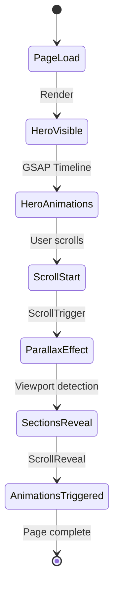

# Design Document: Noticias Page Redesign

## Overview

Este documento detalla la arquitectura técnica y el diseño visual para transformar la página `/noticias` de Ikiwi en una experiencia periodística inmersiva. El rediseño aplica los mismos principios de storytelling implementados en el homepage: tipografía expresiva con AnimatedTitle, animaciones fluidas con ScrollReveal y GSAP, transiciones orgánicas entre secciones, y una narrativa visual que cuenta la historia del kiwi argentino.

La página actual es funcional pero carece del impacto visual y la fluidez del home rediseñado. La transformación mantendrá toda la funcionalidad existente mientras eleva dramáticamente la experiencia visual, posicionando a Ikiwi como líder de la industria.

## Architecture

### Estructura de Componentes

```
┌─────────────────────────────────────────────────────────────┐
│                    /noticias (page.tsx)                      │
├─────────────────────────────────────────────────────────────┤
│  NoticiasHero                                                │
│  ├── Imagen de fondo fullscreen (campo/industria)           │
│  ├── Badge "ACTUALIDAD" animado                             │
│  ├── AnimatedTitle "NOTICIAS" (chars)                       │
│  ├── Subtítulo con ScrollReveal                             │
│  ├── Scroll indicator animado                               │
│  └── Parallax effect en scroll                              │
├─────────────────────────────────────────────────────────────┤
│  SectionTransition (wave → #f5f0e8)                         │
├─────────────────────────────────────────────────────────────┤
│  NoticiaDestacada                                            │
│  ├── Badge categoría + fecha                                │
│  ├── AnimatedTitle (título noticia)                         │
│  ├── Descripción + link externo                             │
│  └── Imagen con overlay (Luis Franch)                       │
├─────────────────────────────────────────────────────────────┤
│  SectionTransition (gradient → #faf8f5)                     │
├─────────────────────────────────────────────────────────────┤
│  TimelineHitos                                               │
│  ├── AnimatedTitle "NUESTRA HISTORIA"                       │
│  └── Timeline cards (2017, 2021, 2022, 2023)                │
├─────────────────────────────────────────────────────────────┤
│  SectionTransition (wave → #faf8f5)                         │
├─────────────────────────────────────────────────────────────┤
│  NoticiasGrid                                                │
│  ├── AnimatedTitle "ÚLTIMAS NOTICIAS"                       │
│  └── Grid de NewsCards (6 noticias)                         │
├─────────────────────────────────────────────────────────────┤
│  SectionTransition (gradient → #f5f0e8)                     │
├─────────────────────────────────────────────────────────────┤
│  StatsKiwi                                                   │
│  ├── AnimatedTitle "EN NÚMEROS"                             │
│  └── Grid 4 stat cards                                      │
├─────────────────────────────────────────────────────────────┤
│  SectionTransition (wave → #faf8f5)                         │
├─────────────────────────────────────────────────────────────┤
│  PrensaSection                                               │
│  ├── AnimatedTitle "EN LOS MEDIOS"                          │
│  ├── Logos de medios (La Nación, Clarín)                    │
│  └── Blockquote destacado                                   │
├─────────────────────────────────────────────────────────────┤
│  SectionTransition (organic → #3f7528)                      │
├─────────────────────────────────────────────────────────────┤
│  NoticiasCTA                                                 │
│  ├── Emoji/icono                                            │
│  ├── AnimatedTitle                                          │
│  └── Botones CTA                                            │
└─────────────────────────────────────────────────────────────┘
```

### Flujo de Datos



## Components and Interfaces

### 1. NoticiasHero

Hero section inmersivo con imagen de fondo, animación de caracteres y parallax.

```typescript
interface NoticiasHeroProps {
  className?: string;
}

// Implementación similar a hero-storytelling.tsx
// - useRef para heroRef, contentRef, titleRef, subtitleRef, scrollIndicatorRef
// - GSAP timeline para animación de entrada
// - ScrollTrigger para parallax
// - SectionTransition al final
```

**Implementación Visual:**
```
┌─────────────────────────────────────────────────────────────┐
│  [Imagen: bg-certifications-aerial.png o similar]           │
│  [Overlay: from-[#3f7528]/40 via-black/30 to-black/50]     │
│                                                             │
│              ● ACTUALIDAD (badge con dot animado)           │
│                                                             │
│                    N O T I C I A S                          │
│              (AnimatedTitle chars, Playfair 7xl)            │
│                                                             │
│           La historia del kiwi argentino                    │
│              contada por quienes la hacen                   │
│                                                             │
│                        ↓                                    │
│                   (scroll indicator)                        │
└─────────────────────────────────────────────────────────────┘
```

### 2. NoticiaDestacada

Sección prominente con la entrevista de Luis Franch.

```typescript
interface NoticiaDestacadaProps {
  news: FeaturedNews;
  className?: string;
}

interface FeaturedNews {
  title: string;
  date: string;
  category: string;
  description: string;
  image: string;
  link: string;
  author?: {
    name: string;
    role: string;
  };
}
```

**Layout Visual:**
```
┌─────────────────────────────────────────────────────────────┐
│  Fondo: #f5f0e8 (warm cream)                                │
│                                                             │
│  ┌─────────────────────────┐ ┌─────────────────────────┐   │
│  │                         │ │                         │   │
│  │  [ENTREVISTA] 17 Feb    │ │    [Imagen]             │   │
│  │                         │ │    Luis Franch          │   │
│  │  "Aspiramos a tener     │ │    aspect-[4/3]         │   │
│  │   la misma calidad      │ │    rounded-2xl          │   │
│  │   de kiwis que          │ │                         │   │
│  │   Nueva Zelanda"        │ │  ┌─────────────────┐    │   │
│  │                         │ │  │ Luis Franch     │    │   │
│  │  Luis Franch habla...   │ │  │ Fundador        │    │   │
│  │                         │ │  └─────────────────┘    │   │
│  │  [Leer artículo →]      │ │                         │   │
│  └─────────────────────────┘ └─────────────────────────┘   │
│                                                             │
│  (grid lg:grid-cols-2 gap-8 items-center)                   │
└─────────────────────────────────────────────────────────────┘
```

### 3. TimelineHitos

Cronología visual de los hitos importantes.

```typescript
interface TimelineHitosProps {
  milestones: Milestone[];
  className?: string;
}

interface Milestone {
  year: string;
  title: string;
  description: string;
  icon: string;
  color?: string;
}
```

**Datos de Hitos:**
```typescript
const milestones: Milestone[] = [
  {
    year: "2017",
    title: "Visión de Calidad",
    description: "Luis Franch declara la aspiración de igualar la calidad de Nueva Zelanda",
    icon: "🎯",
    color: "#3f7528"
  },
  {
    year: "2021",
    title: "Cooperativa Ecco",
    description: "Productores adquieren lote en Miramar para planta de frío",
    icon: "🤝",
    color: "#4a8a30"
  },
  {
    year: "2022",
    title: "Indicación Geográfica",
    description: "Resolución 33/2022: Nace la IG 'Kiwi Mar y Sierras'",
    icon: "🏅",
    color: "#5a9a40"
  },
  {
    year: "2023",
    title: "Exportación a España",
    description: "Primera exportación de kiwi orgánico con IG a Europa",
    icon: "🌍",
    color: "#6aaa50"
  }
];
```

**Layout Visual:**
```
┌─────────────────────────────────────────────────────────────┐
│  Fondo: #faf8f5                                             │
│                                                             │
│              📰 HITOS                                       │
│           NUESTRA HISTORIA                                  │
│                                                             │
│  Desktop (horizontal):                                      │
│  ┌────────┐    ┌────────┐    ┌────────┐    ┌────────┐      │
│  │  🎯    │    │  🤝    │    │  🏅    │    │  🌍    │      │
│  │  2017  │────│  2021  │────│  2022  │────│  2023  │      │
│  │ Visión │    │ Ecco   │    │  IG    │    │España  │      │
│  └────────┘    └────────┘    └────────┘    └────────┘      │
│                                                             │
│  Mobile (vertical):                                         │
│  │                                                          │
│  ├── 🎯 2017 - Visión de Calidad                           │
│  │                                                          │
│  ├── 🤝 2021 - Cooperativa Ecco                            │
│  │                                                          │
│  ├── 🏅 2022 - Indicación Geográfica                       │
│  │                                                          │
│  └── 🌍 2023 - Exportación a España                        │
│                                                             │
└─────────────────────────────────────────────────────────────┘
```

### 4. NewsCard

Card para noticias individuales en el grid.

```typescript
interface NewsCardProps {
  news: NewsItem;
  index: number;
  className?: string;
}

interface NewsItem {
  id: number;
  title: string;
  date: string;
  category: string;
  categoryColor: string;
  image: string | null;
  placeholder?: string;
  link: string;
  excerpt?: string;
}
```

**Estructura del Card:**
```
┌─────────────────────────────────────────┐
│ [Badge: Industria]  ←  top-3 left-3     │
│                                         │
│         [Imagen]                        │
│         aspect-[16/9]                   │
│         object-cover                    │
│                                         │
│ ▓▓▓▓▓▓▓▓▓▓▓▓▓▓▓▓▓▓▓▓▓▓▓▓▓▓▓▓▓▓▓▓▓▓▓▓▓ │ ← Gradient overlay
├─────────────────────────────────────────┤
│ 2024                                    │
│ CoopeKiwi Expande el Cultivo...         │
│ (font-bold, hover:text-[#3f7528])       │
│                                         │
│ La cooperativa expande sus...           │
│ (text-sm text-gray-600 line-clamp-2)    │
│                                         │
│ Leer más →                              │
└─────────────────────────────────────────┘

Hover:
- translate-y: -8px
- shadow: 2xl
- imagen scale: 1.05
- título: text-[#3f7528]
- link gap: aumenta
```

**Colores de Categorías:**
```typescript
const categoryColors: Record<string, string> = {
  "Industria": "bg-[#3f7528]",
  "Exportación": "bg-blue-500",
  "Reconocimiento": "bg-amber-500",
  "Certificación": "bg-purple-500",
  "Infraestructura": "bg-teal-500",
  "Prensa": "bg-gray-600"
};
```

### 5. StatsSection

Estadísticas del kiwi argentino.

```typescript
interface StatsSectionProps {
  stats: Stat[];
  className?: string;
}

interface Stat {
  value: string;
  label: string;
  description: string;
}
```

**Datos:**
```typescript
const stats: Stat[] = [
  { value: "0,45kg", label: "Consumo Per Cápita", description: "Mayor de Latinoamérica" },
  { value: "9", label: "Partidos en la IG", description: "Mar y Sierras" },
  { value: "16,5%", label: "Materia Seca Mínima", description: "Requisito de la IG" },
  { value: "900t", label: "Capacidad Ecco", description: "Planta de frío" }
];
```

**Layout Visual:**
```
┌─────────────────────────────────────────────────────────────┐
│  Fondo: #f5f0e8                                             │
│                                                             │
│              📊 EN NÚMEROS                                  │
│           EL KIWI ARGENTINO                                 │
│                                                             │
│  ┌──────────┐ ┌──────────┐ ┌──────────┐ ┌──────────┐       │
│  │          │ │          │ │          │ │          │       │
│  │  0,45kg  │ │    9     │ │  16,5%   │ │   900t   │       │
│  │  (5xl)   │ │  (5xl)   │ │  (5xl)   │ │  (5xl)   │       │
│  │          │ │          │ │          │ │          │       │
│  │ Consumo  │ │ Partidos │ │ Materia  │ │Capacidad │       │
│  │Per Cápita│ │  en IG   │ │  Seca    │ │  Ecco    │       │
│  │          │ │          │ │          │ │          │       │
│  │ Mayor de │ │ Mar y    │ │Requisito │ │Planta de │       │
│  │ Latam    │ │ Sierras  │ │  de IG   │ │  frío    │       │
│  └──────────┘ └──────────┘ └──────────┘ └──────────┘       │
│                                                             │
│  (grid md:grid-cols-2 lg:grid-cols-4 gap-6)                │
└─────────────────────────────────────────────────────────────┘
```

### 6. PrensaSection

Logos de medios y cita destacada.

```typescript
interface PrensaSectionProps {
  logos: PressLogo[];
  quote: Quote;
  className?: string;
}

interface PressLogo {
  name: string;
  logo: string;
}

interface Quote {
  text: string;
  source: string;
  year?: string;
}
```

**Layout Visual:**
```
┌─────────────────────────────────────────────────────────────┐
│  Fondo: #faf8f5                                             │
│                                                             │
│              📰 EN LOS MEDIOS                               │
│                  PRENSA                                     │
│                                                             │
│         [La Nación logo]    [Clarín logo]                   │
│         (grayscale → color on hover)                        │
│         (opacity-60 → opacity-100 on hover)                 │
│                                                             │
│  ┌─────────────────────────────────────────────────────┐   │
│  │                                                     │   │
│  │                        "                            │   │
│  │                    (text-4xl)                       │   │
│  │                                                     │   │
│  │   Lo que empezó como una inversión de un abogado   │   │
│  │   que leyó una nota periodística, hoy es la mayor  │   │
│  │   productora de kiwi de Argentina, con más de 270  │   │
│  │   hectáreas y exportaciones a cuatro continentes.  │   │
│  │                                                     │   │
│  │                — Diario La Nación, 2019            │   │
│  │                                                     │   │
│  └─────────────────────────────────────────────────────┘   │
│  (bg-white rounded-2xl p-8 shadow-lg)                       │
│                                                             │
└─────────────────────────────────────────────────────────────┘
```

### 7. NoticiasCTA

Call-to-action final.

```typescript
interface NoticiasCTAProps {
  className?: string;
}
```

**Layout Visual:**
```
┌─────────────────────────────────────────────────────────────┐
│  Fondo: #3f7528                                             │
│                                                             │
│                        📱                                   │
│                    (text-5xl)                               │
│                                                             │
│              SEGUINOS EN INSTAGRAM                          │
│              (AnimatedTitle, text-white)                    │
│                                                             │
│         Enterate de las últimas novedades,                  │
│         recetas y contenido sobre el mundo                  │
│              del kiwi argentino                             │
│                                                             │
│  [SEGUIR @KIWI_ARGENTINO]    [VER PRODUCTOS]               │
│   (bg-white text-green)       (outline white)               │
│                                                             │
└─────────────────────────────────────────────────────────────┘
```

## Data Models

### Datos de Noticias

```typescript
// Inline en page.tsx o archivo separado

const featuredNews: FeaturedNews = {
  title: '"Aspiramos a tener la misma calidad de kiwis que Nueva Zelanda"',
  date: "17 de Febrero, 2017",
  category: "Entrevista",
  description: "Luis Franch habla sobre el potencial del kiwi argentino y las aspiraciones de calidad premium. En esta entrevista histórica, el fundador de iKiwi establece la visión que guiaría el desarrollo de la industria.",
  image: "/luis-franch-ceo.png",
  link: "https://www.freshplaza.es/article/3104421/argentina-aspiramos-a-tener-la-misma-calidad-de-kiwis-que-nueva-zelanda/",
  author: {
    name: "Luis Franch",
    role: "Representante & Fundador"
  }
};

const news: NewsItem[] = [
  {
    id: 1,
    title: "CoopeKiwi Expande el Cultivo de Kiwis Orgánicos",
    date: "2024",
    category: "Industria",
    categoryColor: "bg-[#3f7528]",
    image: "/noticia-coopekiwi.png",
    link: "https://mundoagro.io/cl/coopekiwi-expande-el-cultivo-de-kiwis-organicos-en-argentina/",
    excerpt: "La cooperativa expande sus operaciones y abre canales comerciales con Uruguay, Brasil e Italia."
  },
  {
    id: 2,
    title: "Primera Exportación de Kiwi con IG a España",
    date: "Junio 2023",
    category: "Exportación",
    categoryColor: "bg-blue-500",
    image: "/noticia-ig-a-espana.png",
    link: "https://www.argentina.gob.ar/noticias/agricultura-acompano-la-primera-exportacion-de-kiwi-con-indicacion-geografica-espana",
    excerpt: "Hito histórico: primera exportación de kiwi orgánico con Indicación Geográfica a España."
  },
  {
    id: 3,
    title: "Uno de los Mejores Kiwis del Mundo es Argentino",
    date: "2023",
    category: "Reconocimiento",
    categoryColor: "bg-amber-500",
    image: "/noticia-uno-de-los-mejores.png",
    link: "https://ansol.com.ar/cooperativa-kiwis-argentina/principales/",
    excerpt: "La cooperativa produce uno de los mejores kiwis del mundo según expertos internacionales."
  },
  {
    id: 4,
    title: "Indicación Geográfica: Resolución 33/2022",
    date: "Junio 2022",
    category: "Certificación",
    categoryColor: "bg-purple-500",
    image: null,
    placeholder: "🏅",
    link: "https://www.argentina.gob.ar/normativa/nacional/resoluci%C3%B3n-33-2022-366126",
    excerpt: "Publicación oficial del protocolo de la IG 'Kiwi Mar y Sierras del Sudeste de Buenos Aires'."
  },
  {
    id: 5,
    title: "Productores de Kiwi en Miramar",
    date: "Diciembre 2021",
    category: "Infraestructura",
    categoryColor: "bg-teal-500",
    image: "/noticia-cooperativa-miramar.png",
    link: "https://regionmardelplata.com/ver-noticia.asp?noticia=miramar-ahora-productores-de-kiwi-se-suman-al-sector-industrial-de-miramar&codigo=14249",
    excerpt: "Productores de kiwi se suman al Sector Industrial de Miramar para construir planta de frío."
  },
  {
    id: 6,
    title: "El Kiwi se Abre Camino entre Mar y Sierras",
    date: "2019",
    category: "Prensa",
    categoryColor: "bg-gray-600",
    image: "/noticia-kiwi-se-abre-camino.png",
    link: "https://bichosdecampo.com/el-kiwi-se-abre-camino-entre-el-mar-y-las-sierras/",
    excerpt: "Reportaje sobre el crecimiento de la industria del kiwi en la región de Mar del Plata."
  }
];

const pressLogos: PressLogo[] = [
  { name: "La Nación", logo: "/logo-lanacion.png" },
  { name: "Clarín", logo: "/logo-clarin.png" }
];

const pressQuote: Quote = {
  text: "Lo que empezó como una inversión de un abogado que leyó una nota periodística, hoy es la mayor productora de kiwi de Argentina, con más de 270 hectáreas y exportaciones a cuatro continentes.",
  source: "Diario La Nación",
  year: "2019"
};
```

## Visual Design

### Estructura Completa de la Página

```
┌─────────────────────────────────────────────────────────────┐
│ HERO (100vh)                                                │
│ ┌─────────────────────────────────────────────────────────┐ │
│ │  [bg-certifications-aerial.png + overlay verde/oscuro]  │ │
│ │                                                         │ │
│ │         ● ACTUALIDAD                                    │ │
│ │              (badge tracking-[0.3em])                   │ │
│ │                                                         │ │
│ │              N O T I C I A S                            │ │
│ │         (AnimatedTitle chars, Playfair 7xl)             │ │
│ │                                                         │ │
│ │      La historia del kiwi argentino                     │ │
│ │         contada por quienes la hacen                    │ │
│ │                                                         │ │
│ │                    ↓                                    │ │
│ │              (scroll indicator)                         │ │
│ └─────────────────────────────────────────────────────────┘ │
│ ~~~~~~~~~~~~~ Wave Transition → #f5f0e8 ~~~~~~~~~~~~~       │
├─────────────────────────────────────────────────────────────┤
│ NOTICIA DESTACADA (py-24)                                   │
│ ┌─────────────────────────────────────────────────────────┐ │
│ │  Fondo: #f5f0e8                                         │ │
│ │                                                         │ │
│ │  ┌─────────────────────┐ ┌─────────────────────┐       │ │
│ │  │ [ENTREVISTA] 2017   │ │                     │       │ │
│ │  │                     │ │   [Luis Franch]     │       │ │
│ │  │ "Aspiramos a tener  │ │                     │       │ │
│ │  │  la misma calidad   │ │   Representante     │       │ │
│ │  │  de kiwis que NZ"   │ │   & Fundador        │       │ │
│ │  │                     │ │                     │       │ │
│ │  │ [Leer artículo →]   │ │                     │       │ │
│ │  └─────────────────────┘ └─────────────────────┘       │ │
│ └─────────────────────────────────────────────────────────┘ │
│ ═══════════ Gradient Transition → #faf8f5 ═══════════       │
├─────────────────────────────────────────────────────────────┤
│ TIMELINE HITOS (py-24)                                      │
│ ┌─────────────────────────────────────────────────────────┐ │
│ │  Fondo: #faf8f5                                         │ │
│ │                                                         │ │
│ │              📰 HITOS                                   │ │
│ │           NUESTRA HISTORIA                              │ │
│ │                                                         │ │
│ │  ┌────┐    ┌────┐    ┌────┐    ┌────┐                  │ │
│ │  │2017│────│2021│────│2022│────│2023│                  │ │
│ │  │ 🎯 │    │ 🤝 │    │ 🏅 │    │ 🌍 │                  │ │
│ │  └────┘    └────┘    └────┘    └────┘                  │ │
│ └─────────────────────────────────────────────────────────┘ │
│ ~~~~~~~~~~~~~ Wave Transition → #faf8f5 ~~~~~~~~~~~~~       │
├─────────────────────────────────────────────────────────────┤
│ GRID NOTICIAS (py-24)                                       │
│ ┌─────────────────────────────────────────────────────────┐ │
│ │  Fondo: #faf8f5                                         │ │
│ │                                                         │ │
│ │              📰 MÁS NOTICIAS                            │ │
│ │           ÚLTIMAS NOVEDADES                             │ │
│ │                                                         │ │
│ │  ┌──────┐ ┌──────┐ ┌──────┐                            │ │
│ │  │      │ │      │ │      │                            │ │
│ │  │      │ │      │ │      │                            │ │
│ │  └──────┘ └──────┘ └──────┘                            │ │
│ │  ┌──────┐ ┌──────┐ ┌──────┐                            │ │
│ │  │      │ │      │ │      │                            │ │
│ │  │      │ │      │ │      │                            │ │
│ │  └──────┘ └──────┘ └──────┘                            │ │
│ └─────────────────────────────────────────────────────────┘ │
│ ═══════════ Gradient Transition → #f5f0e8 ═══════════       │
├─────────────────────────────────────────────────────────────┤
│ ESTADÍSTICAS (py-24)                                        │
│ ┌─────────────────────────────────────────────────────────┐ │
│ │  Fondo: #f5f0e8                                         │ │
│ │                                                         │ │
│ │              📊 EN NÚMEROS                              │ │
│ │           EL KIWI ARGENTINO                             │ │
│ │                                                         │ │
│ │  ┌────────┐ ┌────────┐ ┌────────┐ ┌────────┐           │ │
│ │  │ 0,45kg │ │   9    │ │ 16,5%  │ │  900t  │           │ │
│ │  │Consumo │ │Partidos│ │Materia │ │Capacid.│           │ │
│ │  └────────┘ └────────┘ └────────┘ └────────┘           │ │
│ └─────────────────────────────────────────────────────────┘ │
│ ~~~~~~~~~~~~~ Wave Transition → #faf8f5 ~~~~~~~~~~~~~       │
├─────────────────────────────────────────────────────────────┤
│ PRENSA (py-24)                                              │
│ ┌─────────────────────────────────────────────────────────┐ │
│ │  Fondo: #faf8f5                                         │ │
│ │                                                         │ │
│ │              📰 EN LOS MEDIOS                           │ │
│ │                  PRENSA                                 │ │
│ │                                                         │ │
│ │         [La Nación]    [Clarín]                         │ │
│ │                                                         │ │
│ │  ┌─────────────────────────────────────────────────┐   │ │
│ │  │  "Lo que empezó como una inversión..."          │   │ │
│ │  │                    — La Nación, 2019            │   │ │
│ │  └─────────────────────────────────────────────────┘   │ │
│ └─────────────────────────────────────────────────────────┘ │
│ ═══════════ Organic Transition → #3f7528 ═══════════        │
├─────────────────────────────────────────────────────────────┤
│ CTA FINAL (py-24)                                           │
│ ┌─────────────────────────────────────────────────────────┐ │
│ │  Fondo: #3f7528                                         │ │
│ │                                                         │ │
│ │                    📱                                   │ │
│ │                                                         │ │
│ │        SEGUINOS EN INSTAGRAM                            │ │
│ │                                                         │ │
│ │     Enterate de las últimas novedades                   │ │
│ │                                                         │ │
│ │  [SEGUIR @KIWI_ARGENTINO]  [VER PRODUCTOS]              │ │
│ └─────────────────────────────────────────────────────────┘ │
└─────────────────────────────────────────────────────────────┘
```

### Paleta de Colores

| Color | Hex | Uso |
|-------|-----|-----|
| Canopy Green | #3f7528 | CTA backgrounds, badges activos, acentos |
| Cream | #faf8f5 | Fondo principal, secciones claras |
| Warm Cream | #f5f0e8 | Fondo sección destacada, stats |
| Lime Accent | #8DC54D | Hover states, highlights |
| Text Dark | #1a1a1a | Títulos principales |
| Text Gray | #6b7280 | Texto secundario, fechas |
| White | #ffffff | Texto sobre verde, cards |

### Tipografía

- **Títulos principales**: `font-[family-name:var(--font-playfair)]` - Black (900)
- **Badges/Labels**: Sans-serif, tracking-[0.3em], uppercase, text-sm
- **Cuerpo**: Geist Sans (default)
- **Citas**: Italic, text-lg
- **Datos estadísticos**: Sans-serif, font-bold, text-4xl/5xl

### Animaciones

#### Hero Title (chars) - Estilo hero-storytelling
```typescript
// GSAP Timeline
const tl = gsap.timeline({ defaults: { ease: "power4.out" } });

tl.fromTo(
  chars,
  { y: 100, opacity: 0, rotateX: -90 },
  { y: 0, opacity: 1, rotateX: 0, duration: 1, stagger: 0.08 }
);

// Parallax en scroll
gsap.to(contentRef.current, {
  y: 150,
  opacity: 0,
  ease: "none",
  scrollTrigger: {
    trigger: heroRef.current,
    start: "top top",
    end: "bottom top",
    scrub: true,
  },
});
```

#### Section Titles (words)
```
Delay: 0s
Duration: 0.8s per word
Stagger: 0.1s
Ease: power3.out

ÚLTIMAS → NOVEDADES
```

#### Cards (fadeUp + stagger)
```
Initial: { y: 50, opacity: 0 }
Final: { y: 0, opacity: 1 }
Duration: 0.8s
Stagger: 0.1s (entre cards)
Trigger: top 80%
```

#### Timeline Hitos (stagger)
```
Initial: { y: 30, opacity: 0, scale: 0.9 }
Final: { y: 0, opacity: 1, scale: 1 }
Duration: 0.6s
Stagger: 0.15s
```

#### Card Hover
```css
.news-card {
  transition: all 0.5s ease-out;
}
.news-card:hover {
  transform: translateY(-8px);
  box-shadow: 0 25px 50px -12px rgba(0, 0, 0, 0.25);
}
.news-card:hover img {
  transform: scale(1.05);
}
.news-card:hover h3 {
  color: #3f7528;
}
```

#### Scroll Indicator
```css
.scroll-indicator {
  animation: bounce 2s infinite;
}
@keyframes bounce {
  0%, 100% { transform: translateY(0); }
  50% { transform: translateY(8px); }
}
```

## Error Handling

### Fallbacks

1. **Sin JavaScript**: Todo el contenido visible, sin animaciones
2. **Reduced Motion**: Detectar preferencia y desactivar animaciones
3. **Imágenes fallidas**: Mostrar placeholder con emoji o color de fondo
4. **Links externos rotos**: Mantener información visible, link deshabilitado

```typescript
// Detección de preferencias
const prefersReducedMotion = typeof window !== 'undefined' 
  ? window.matchMedia('(prefers-reduced-motion: reduce)').matches 
  : false;

// Fallback para imagen
{news.image ? (
  <Image src={news.image} alt={news.title} fill className="object-cover" />
) : (
  <div className="absolute inset-0 flex items-center justify-center bg-gradient-to-br from-gray-100 to-gray-200">
    <span className="text-6xl">{news.placeholder || "📰"}</span>
  </div>
)}
```

### Estados de Carga

- Imágenes: Usar Next.js Image con `placeholder="blur"` cuando sea posible
- Contenido: Visible inmediatamente (SSR)

## Testing Strategy

### Tests Visuales

1. Verificar animaciones GSAP en Chrome DevTools
2. Verificar parallax effect en hero
3. Test en diferentes breakpoints (375px, 768px, 1024px, 1440px)
4. Verificar transiciones entre secciones

### Tests de Accesibilidad

1. Contraste de colores (WCAG AA)
2. Navegación por teclado en cards y links
3. Screen reader compatibility
4. Alt text en imágenes
5. Links externos con indicador visual

### Tests de Performance

1. Lighthouse score > 90
2. LCP < 2.5s
3. CLS < 0.1
4. Verificar lazy loading de imágenes
5. Verificar que GSAP no bloquea el render inicial

### Tests Funcionales

1. Links externos abren en nueva pestaña
2. Hover states se aplican correctamente
3. Animaciones respetan reduced-motion
4. Timeline se muestra correctamente en mobile y desktop

## Implementation Notes

### Archivos a Modificar

```
src/
└── app/
    └── noticias/
        └── page.tsx          # REESCRIBIR COMPLETO
```

### Componentes Reutilizados

- `ScrollReveal` - Para animaciones de entrada
- `AnimatedTitle` - Para títulos con reveal
- `SectionTransition` - Para transiciones entre secciones
- `Button` - Para CTAs
- `Badge` - Para categorías

### Componentes Nuevos (inline en page.tsx)

No se requieren componentes nuevos separados. Todo se implementará inline en page.tsx siguiendo el patrón del home.

### Consideraciones de Performance

1. Usar `priority` en imagen del hero
2. Lazy load en imágenes del grid
3. Registrar GSAP plugins una sola vez
4. Cleanup de ScrollTrigger en useEffect return
5. Limitar número de animaciones simultáneas

### Orden de Implementación Sugerido

1. Hero section con GSAP animations y parallax
2. Noticia destacada con layout de dos columnas
3. Timeline de hitos
4. Grid de noticias con cards
5. Sección de estadísticas
6. Sección de prensa con logos y cita
7. CTA final
8. Transiciones entre todas las secciones
9. Pulido de animaciones y responsive
10. Testing y optimización

### Dependencias

```typescript
// Ya instaladas en el proyecto
import { gsap } from "gsap";
import { ScrollTrigger } from "gsap/ScrollTrigger";
import Image from "next/image";
import Link from "next/link";
import { Button } from "@/components/ui/button";
import { Badge } from "@/components/ui/badge";
import { ScrollReveal } from "@/components/animations/scroll-reveal";
import { AnimatedTitle } from "@/components/animations/animated-title";
import { SectionTransition } from "@/components/animations/section-transition";
```
