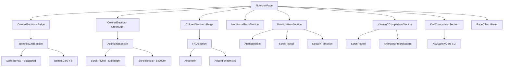

# Design Document - Nutrición Page Redesign

## Overview

El rediseño de la página `/nutricion` transformará la experiencia actual en una narrativa visual inmersiva que cuenta la historia del kiwi como superalimento. Siguiendo la filosofía de diseño establecida en el home, la página utilizará animaciones GSAP con ScrollTrigger, transiciones fluidas entre secciones, tipografía expresiva Playfair Display, y una paleta de colores orgánica centrada en el verde #3f7528.

La arquitectura se basa en secciones modulares que fluyen naturalmente, cada una revelándose con animaciones al scroll, creando un storytelling visual que guía al usuario desde el impacto inicial del hero hasta la acción final del CTA.

## Architecture

```
┌─────────────────────────────────────────────────────────────────┐
│                    /nutricion Page                               │
├─────────────────────────────────────────────────────────────────┤
│                                                                  │
│  ┌───────────────────────────────────────────────────────────┐  │
│  │              NutritionHeroSection                          │  │
│  │  - Full viewport height                                    │  │
│  │  - Animated title with GSAP                                │  │
│  │  - Parallax content on scroll                              │  │
│  │  - Wave transition to next section                         │  │
│  └───────────────────────────────────────────────────────────┘  │
│                           │                                      │
│                           ▼                                      │
│  ┌───────────────────────────────────────────────────────────┐  │
│  │           VitaminCComparisonSection                        │  │
│  │  - Animated progress bars                                  │  │
│  │  - Fruit icons with values                                 │  │
│  │  - ScrollReveal animations                                 │  │
│  └───────────────────────────────────────────────────────────┘  │
│                           │                                      │
│                           ▼                                      │
│  ┌───────────────────────────────────────────────────────────┐  │
│  │              BenefitsGridSection                           │  │
│  │  - 6 benefit cards with hover effects                      │  │
│  │  - Staggered reveal animations                             │  │
│  │  - ColoredSection wrapper (beige)                          │  │
│  └───────────────────────────────────────────────────────────┘  │
│                           │                                      │
│                           ▼                                      │
│  ┌───────────────────────────────────────────────────────────┐  │
│  │            NutritionalFactsSection                         │  │
│  │  - Centered card design                                    │  │
│  │  - Nutrient list with values                               │  │
│  └───────────────────────────────────────────────────────────┘  │
│                           │                                      │
│                           ▼                                      │
│  ┌───────────────────────────────────────────────────────────┐  │
│  │              ActinidinaSection                             │  │
│  │  - Two-column layout                                       │  │
│  │  - Converging slide animations                             │  │
│  │  - ColoredSection wrapper (greenLight)                     │  │
│  └───────────────────────────────────────────────────────────┘  │
│                           │                                      │
│                           ▼                                      │
│  ┌───────────────────────────────────────────────────────────┐  │
│  │            KiwiComparisonSection                           │  │
│  │  - Verde vs Amarillo cards                                 │  │
│  │  - Product images                                          │  │
│  │  - Highlighted superior values                             │  │
│  └───────────────────────────────────────────────────────────┘  │
│                           │                                      │
│                           ▼                                      │
│  ┌───────────────────────────────────────────────────────────┐  │
│  │                FAQSection                                  │  │
│  │  - Accordion component                                     │  │
│  │  - 5 expandable questions                                  │  │
│  │  - ColoredSection wrapper (beige)                          │  │
│  └───────────────────────────────────────────────────────────┘  │
│                           │                                      │
│                           ▼                                      │
│  ┌───────────────────────────────────────────────────────────┐  │
│  │                PageCTA (green variant)                     │  │
│  │  - Two action buttons                                      │  │
│  │  - Final call to action                                    │  │
│  └───────────────────────────────────────────────────────────┘  │
│                                                                  │
└─────────────────────────────────────────────────────────────────┘
```

## Components and Interfaces

### 1. NutritionHeroSection (Nuevo Componente)

```typescript
// src/components/sections/nutrition-hero.tsx
"use client";

interface NutritionHeroProps {
  // No props needed - self-contained component
}

// Internal state and refs
const heroRef = useRef<HTMLDivElement>(null);
const contentRef = useRef<HTMLDivElement>(null);
const titleRef = useRef<HTMLHeadingElement>(null);

// GSAP animations:
// 1. Initial entrance animation for title characters
// 2. Parallax effect on scroll (content moves up, opacity decreases)
// 3. Decorative blur elements with subtle animation
```

**Estructura Visual:**
```
┌─────────────────────────────────────────────────────────────┐
│  [Decorative blur - top right - lime-400/20]                │
│                                                              │
│           ┌─────────────────────────────────┐               │
│           │  NUTRICIÓN & SALUD (badge)      │               │
│           └─────────────────────────────────┘               │
│                                                              │
│     ╔═══════════════════════════════════════════════╗       │
│     ║   1 KIWI = 1 KILO DE LIMONES                  ║       │
│     ║        (AnimatedTitle - white)                 ║       │
│     ╚═══════════════════════════════════════════════╝       │
│                                                              │
│              en Vitamina C (lime-300)                        │
│                                                              │
│  [Decorative blur - bottom left - white/10]                 │
│                                                              │
│  ~~~~~~~~~~~~~ Wave Transition ~~~~~~~~~~~~~                │
└─────────────────────────────────────────────────────────────┘
```

### 2. VitaminCComparisonSection (Nuevo Componente)

```typescript
// src/components/sections/vitamin-c-comparison.tsx
"use client";

interface VitaminCItem {
  fruit: string;
  amount: string;
  percentage: number;
  icon: string;
}

const vitaminCData: VitaminCItem[] = [
  { fruit: "Kiwi Verde", amount: "92.7 mg", percentage: 100, icon: "🥝" },
  { fruit: "Naranja", amount: "53.2 mg", percentage: 57, icon: "🍊" },
  { fruit: "Frutilla", amount: "58.8 mg", percentage: 63, icon: "🍓" },
  { fruit: "Limón", amount: "53 mg", percentage: 57, icon: "🍋" },
  { fruit: "Manzana", amount: "4.6 mg", percentage: 5, icon: "🍎" },
];

// Animation: Progress bars animate width from 0 to final value
// Uses GSAP ScrollTrigger for viewport detection
```

**Estructura Visual:**
```
┌─────────────────────────────────────────────────────────────┐
│                    COMPARACIÓN (badge)                       │
│              Vitamina C por 100g (title)                     │
│                                                              │
│  ┌─────────────────────────────────────────────────────┐    │
│  │  🥝  Kiwi Verde          ████████████████████  92.7mg│    │
│  │  🍊  Naranja             ██████████░░░░░░░░░  53.2mg│    │
│  │  🍓  Frutilla            ███████████░░░░░░░░  58.8mg│    │
│  │  🍋  Limón               ██████████░░░░░░░░░  53.0mg│    │
│  │  🍎  Manzana             █░░░░░░░░░░░░░░░░░░   4.6mg│    │
│  └─────────────────────────────────────────────────────┘    │
│                                                              │
└─────────────────────────────────────────────────────────────┘
```

### 3. BenefitsGridSection (Nuevo Componente)

```typescript
// src/components/sections/nutrition-benefits-grid.tsx
"use client";

interface Benefit {
  icon: string;
  title: string;
  description: string;
  detail: string;
  color: string; // Tailwind gradient classes
}

const benefits: Benefit[] = [
  { 
    icon: "💪", 
    title: "Sistema Inmunológico", 
    description: "Fortalece las defensas naturales del cuerpo.",
    detail: "Un kiwi aporta más del 100% del valor diario de vitamina C.",
    color: "from-blue-500 to-cyan-500"
  },
  // ... 5 more benefits
];

// Hover effects: translateY(-8px), shadow increase, icon scale
// Staggered ScrollReveal with 0.1s delay between cards
```

**Estructura de Tarjeta:**
```
┌─────────────────────────────┐
│  ┌─────────┐                │
│  │  💪     │  (gradient bg) │
│  └─────────┘                │
│                             │
│  Sistema Inmunológico       │
│  (font-bold, gray-900)      │
│                             │
│  Fortalece las defensas...  │
│  (text-sm, gray-600)        │
│                             │
│  Un kiwi aporta más del...  │
│  (text-xs, #3f7528)         │
└─────────────────────────────┘
```

### 4. NutritionalFactsCard (Nuevo Componente)

```typescript
// src/components/sections/nutritional-facts-card.tsx
"use client";

interface NutrientFact {
  nutrient: string;
  value: string;
  unit: string;
}

const nutritionalFacts: NutrientFact[] = [
  { nutrient: "Calorías", value: "61", unit: "kcal" },
  { nutrient: "Vitamina C", value: "92.7", unit: "mg (103% VD)" },
  { nutrient: "Fibra", value: "3", unit: "g (12% VD)" },
  { nutrient: "Potasio", value: "312", unit: "mg" },
  { nutrient: "Vitamina K", value: "40.3", unit: "µg (34% VD)" },
  { nutrient: "Vitamina E", value: "1.5", unit: "mg" },
];
```

### 5. ActinidinaSection (Nuevo Componente)

```typescript
// src/components/sections/actinidina-section.tsx
"use client";

// Two-column layout with converging animations
// Left column: slideRight animation
// Right column: slideLeft animation

const actinidinabenefits = [
  "Mejora la digestión de proteínas",
  "Reduce la hinchazón después de comidas",
  "Ideal como postre después de carnes",
  "Puede usarse como ablandador natural",
];
```

### 6. KiwiComparisonSection (Nuevo Componente)

```typescript
// src/components/sections/kiwi-comparison.tsx
"use client";

interface KiwiVariety {
  name: string;
  variety: string;
  image: string;
  borderColor: string;
  stats: {
    vitaminC: { value: string; highlight: boolean };
    fiber: { value: string; highlight: boolean };
    actinidina: { value: string; highlight: boolean };
    flavor: { value: string; highlight: boolean };
  };
}

const varieties: KiwiVariety[] = [
  {
    name: "Kiwi Verde",
    variety: "Hayward",
    image: "/product-kiwi-verde.png",
    borderColor: "border-[#3f7528]/30",
    stats: {
      vitaminC: { value: "92.7 mg/100g", highlight: false },
      fiber: { value: "3g (más alto) ⬆️", highlight: true },
      actinidina: { value: "Alta ⬆️", highlight: true },
      flavor: { value: "Ácido-dulce", highlight: false },
    },
  },
  // Kiwi Amarillo...
];
```

### 7. FAQSection (Actualización del existente)

```typescript
// Utiliza Accordion de shadcn/ui
// Wrapped en ColoredSection con backgroundColor="beige"
// Transición wave hacia #3f7528 para el CTA final

const faqs = [
  { 
    question: "¿Cuántos kiwis puedo comer al día?", 
    answer: "Se recomienda consumir 1-3 kiwis al día..." 
  },
  // ... 4 more FAQs
];
```

## Data Models

### Vitamin C Comparison Data
```typescript
interface VitaminCComparison {
  fruit: string;
  amount: string;      // e.g., "92.7 mg"
  percentage: number;  // 0-100, relative to kiwi
  icon: string;        // emoji
}
```

### Benefit Card Data
```typescript
interface BenefitCard {
  icon: string;        // emoji
  title: string;
  description: string;
  detail: string;
  color: string;       // Tailwind gradient classes
}
```

### Nutritional Fact Data
```typescript
interface NutritionalFact {
  nutrient: string;
  value: string;
  unit: string;
}
```

### FAQ Data
```typescript
interface FAQ {
  question: string;
  answer: string;
}
```

### Kiwi Variety Comparison Data
```typescript
interface KiwiVarietyComparison {
  name: string;
  variety: string;
  image: string;
  borderColor: string;
  stats: Record<string, { value: string; highlight: boolean }>;
}
```

## Error Handling

### Animation Fallbacks
```typescript
// Check for reduced motion preference
const prefersReducedMotion = window.matchMedia(
  "(prefers-reduced-motion: reduce)"
).matches;

if (prefersReducedMotion) {
  // Skip animations, show content immediately
  gsap.set(elements, { opacity: 1, y: 0 });
  return;
}
```

### Image Loading Errors
```typescript
// Next.js Image component handles fallbacks
// Use placeholder="blur" for better UX
// Implement onError callback for critical images
```

### GSAP Cleanup
```typescript
useEffect(() => {
  const ctx = gsap.context(() => {
    // All GSAP animations here
  }, containerRef);

  return () => {
    ctx.revert(); // Clean up all animations
  };
}, []);
```

## Testing Strategy

### Visual Testing
1. Verificar que todas las animaciones se ejecuten correctamente en Chrome, Firefox y Safari
2. Probar responsive design en breakpoints: 320px, 768px, 1024px, 1440px
3. Validar que las transiciones entre secciones sean fluidas sin saltos visuales

### Accessibility Testing
1. Verificar que prefers-reduced-motion desactive animaciones
2. Probar navegación con teclado en el acordeón de FAQs
3. Validar contraste de colores (WCAG AA mínimo)

### Performance Testing
1. Medir LCP < 2.5s en conexión 4G simulada
2. Verificar que no haya memory leaks en animaciones
3. Validar que las imágenes se carguen con lazy loading

### Unit Tests (Opcional)
```typescript
// Test data integrity
describe('Nutrition Data', () => {
  it('should have valid vitamin C percentages', () => {
    vitaminCData.forEach(item => {
      expect(item.percentage).toBeGreaterThanOrEqual(0);
      expect(item.percentage).toBeLessThanOrEqual(100);
    });
  });
});
```

## Component Hierarchy Diagram



## Animation Timeline

```
Page Load
    │
    ├── 0ms: Hero background visible
    │
    ├── 100ms: Badge fades in
    │
    ├── 200ms: Title characters animate (stagger 80ms each)
    │
    ├── 600ms: Subtitle fades in
    │
    └── 800ms: Decorative blurs animate

On Scroll (each section)
    │
    ├── Trigger: Element enters viewport at 85%
    │
    ├── Animation: fadeUp (y: 50 → 0, opacity: 0 → 1)
    │
    ├── Duration: 800ms
    │
    ├── Easing: power3.out
    │
    └── Stagger (for grids): 100ms between items
```

## Color Palette Reference

| Color | Hex | Usage |
|-------|-----|-------|
| Verde Principal | #3f7528 | Hero bg, CTAs, accents |
| Verde Hover | #4a8a30 | Button hover states |
| Verde Oscuro | #1a3311 | Deep shadows |
| Fondo Claro | #faf8f5 | Main background |
| Beige | #f5f0e8 | Alternate sections |
| Lime 300 | - | Accent text on dark |
| Lime 400 | - | Decorative elements |
| Gray 900 | - | Primary text |
| Gray 600 | - | Secondary text |
| Gray 500 | - | Tertiary text |

## Responsive Breakpoints

```css
/* Mobile First Approach */
/* Base: 0-767px */
.section { padding: 6rem 1rem; }
.title { font-size: 2.25rem; } /* text-4xl */
.grid { grid-template-columns: 1fr; }

/* Tablet: 768px+ */
@media (min-width: 768px) {
  .section { padding: 8rem 1rem; }
  .title { font-size: 3rem; } /* text-5xl */
  .grid { grid-template-columns: repeat(2, 1fr); }
}

/* Desktop: 1024px+ */
@media (min-width: 1024px) {
  .title { font-size: 3.75rem; } /* text-6xl */
  .grid { grid-template-columns: repeat(3, 1fr); }
}
```

## File Structure

```
src/
├── app/
│   └── nutricion/
│       └── page.tsx (Updated - imports new sections)
│
└── components/
    └── sections/
        ├── nutrition-hero.tsx (New)
        ├── vitamin-c-comparison.tsx (New)
        ├── nutrition-benefits-grid.tsx (New)
        ├── nutritional-facts-card.tsx (New)
        ├── actinidina-section.tsx (New)
        ├── kiwi-comparison.tsx (New)
        ├── nutrition-faq.tsx (New)
        └── page-cta.tsx (Existing - reused)
```
