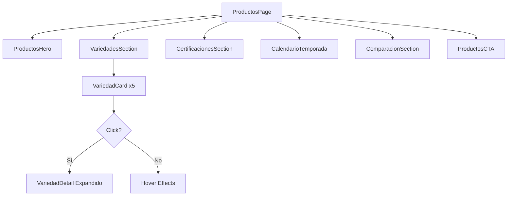

# Design Document: Rediseño Página de Productos iKiwi

## Overview

Este documento detalla la arquitectura técnica y el diseño visual para transformar la página de Productos (/productos) de iKiwi en una experiencia inmersiva de storytelling visual. El diseño aplica el sistema premium implementado en el homepage, utilizando GSAP ScrollTrigger, Lenis smooth scrolling, y componentes de animación existentes.

## Architecture

### Estructura de Componentes

```
src/app/productos/page.tsx (REDISEÑAR)
├── ProductosHero (NUEVO - hero inmersivo con parallax)
├── VariedadesSection (NUEVO - grid de 5 variedades)
│   └── VariedadCard (NUEVO - card interactiva expandible)
├── VariedadDetail (NUEVO - detalle expandido)
├── CertificacionesSection (EXISTENTE - mejorar)
├── CalendarioTemporada (EXISTENTE - mejorar)
├── ComparacionSection (NUEVO - comparación de variedades)
└── ProductosCTA (EXISTENTE - mejorar con PageCTA)
```

### Flujo de Datos




## Components and Interfaces

### 1. ProductosHero Component

```typescript
// Componente hero inmersivo para la página de productos
interface ProductosHeroProps {
  className?: string;
}

// Implementación:
// - Altura mínima: min-h-[70vh]
// - Imagen de fondo: /bg-products-orchard-bokeh.png
// - Overlay gradiente: from-[#3f7528]/95 via-[#3f7528]/85 to-[#2d5a1c]/90
// - Título animado con GSAP (caracteres con rotación 3D)
// - Parallax en scroll con opacidad decreciente
// - Indicador de scroll con animación bounce
// - SectionTransition wave al final
```

### 2. VariedadCard Component

```typescript
interface VariedadCardProps {
  variedad: KiwiVariedad;
  index: number;
  isExpanded: boolean;
  onToggle: () => void;
}

interface KiwiVariedad {
  id: string;
  name: string;
  variety: string;
  tagline: string;
  description: string;
  badge: string;
  badgeColor: string;
  image: string;
  gradient: string;
  characteristics: Caracteristica[];
  nutrition: NutricionItem[];
  uses: string[];
}
```

### 3. VariedadDetail Component

```typescript
interface VariedadDetailProps {
  variedad: KiwiVariedad;
  isOpen: boolean;
  onClose: () => void;
}

// Secciones del detalle:
// - Header con imagen grande y badge
// - Grid de características (2 columnas)
// - Tabla nutricional con barras de progreso
// - Lista de usos con iconos
// - Botón de cierre
```

### 4. ComparacionSection Component

```typescript
interface ComparacionSectionProps {
  variedades: KiwiVariedad[];
}

// Muestra comparación lado a lado de Verde vs Gold vs Rojo
// con indicadores visuales de superioridad por característica
```

## Data Models

### Modelo de Variedades de Kiwi

```typescript
const variedades: KiwiVariedad[] = [
  {
    id: "verde",
    name: "KIWI VERDE",
    variety: "Hayward",
    tagline: "REFRESCANTE Y ÁCIDO",
    description: "Variedad insignia de nuestra producción. Originario de Nueva Zelanda, encuentra en el sudeste bonaerense las condiciones ideales.",
    badge: "Más Popular",
    badgeColor: "bg-green-500",
    image: "/product-kiwi-verde.png",
    gradient: "from-green-500 to-emerald-600",
    characteristics: [
      { label: "Sabor", value: "Dulce-ácido equilibrado" },
      { label: "Textura", value: "Jugosa y suave" },
      { label: "Piel", value: "Marrón con vellosidad" },
      { label: "Temporada", value: "Mayo a Octubre" },
      { label: "Almacenamiento", value: "2-3 meses en frío" },
      { label: "Maduración", value: "Continúa fuera de la planta" }
    ],
    nutrition: [
      { nutrient: "Vitamina C", value: "92.7", unit: "mg" },
      { nutrient: "Fibra", value: "3", unit: "g" },
      { nutrient: "Potasio", value: "312", unit: "mg" },
      { nutrient: "Vitamina K", value: "40.3", unit: "μg" },
      { nutrient: "Vitamina E", value: "1.5", unit: "mg" }
    ],
    uses: ["Consumo fresco", "Smoothies y jugos", "Postres", "Ensaladas", "Salsas para carnes"]
  },
  {
    id: "gold",
    name: "KIWI GOLD",
    variety: "Jingold",
    tagline: "DULCE Y TROPICAL",
    description: "La evolución premium del kiwi. Desarrollado para quienes buscan una experiencia más dulce y tropical.",
    badge: "Premium",
    badgeColor: "bg-amber-500",
    image: "/product-kiwi-amarillo.png",
    gradient: "from-amber-400 to-yellow-500",
    characteristics: [
      { label: "Sabor", value: "Dulce tropical" },
      { label: "Textura", value: "Suave y cremosa" },
      { label: "Piel", value: "Más lisa, menos peluda" },
      { label: "Temporada", value: "Mayo a Septiembre" },
      { label: "Acidez", value: "Menor que el verde" },
      { label: "Brix", value: "16-18° (más dulce)" }
    ],
    nutrition: [
      { nutrient: "Vitamina C", value: "161", unit: "mg" },
      { nutrient: "Fibra", value: "2", unit: "g" },
      { nutrient: "Potasio", value: "315", unit: "mg" },
      { nutrient: "Folato", value: "31", unit: "μg" },
      { nutrient: "Vitamina E", value: "1.4", unit: "mg" }
    ],
    uses: ["Consumo fresco", "Postres gourmet", "Macedonias", "Decoración", "Exportación"]
  },
  {
    id: "rojo",
    name: "KIWI ROJO",
    variety: "Red Passion",
    tagline: "EXÓTICO Y ÚNICO",
    description: "La joya más reciente de nuestra producción. Su pulpa combina tonos verdes con un corazón rojo intenso.",
    badge: "Exclusivo",
    badgeColor: "bg-red-500",
    image: "/product-kiwi-rojo.png", // Necesita imagen
    gradient: "from-red-400 via-pink-500 to-green-500",
    characteristics: [
      { label: "Sabor", value: "Dulce con notas a frutos rojos" },
      { label: "Textura", value: "Suave y jugosa" },
      { label: "Piel", value: "Lisa, similar al amarillo" },
      { label: "Color interior", value: "Verde con centro rojo" },
      { label: "Disponibilidad", value: "Edición limitada" },
      { label: "Desarrollo", value: "Con U. de Bolonia" }
    ],
    nutrition: [
      { nutrient: "Vitamina C", value: "Alto", unit: "" },
      { nutrient: "Antocianinas", value: "Presente", unit: "" },
      { nutrient: "Fibra", value: "2.5", unit: "g" },
      { nutrient: "Antioxidantes", value: "Muy alto", unit: "" }
    ],
    uses: ["Consumo fresco", "Presentaciones gourmet", "Decoración premium", "Regalo exclusivo"]
  },
  {
    id: "organico",
    name: "KIWI ORGÁNICO",
    variety: "Certificado",
    tagline: "PURO Y NATURAL",
    description: "Representa nuestro compromiso con la sustentabilidad. Cultivado sin agroquímicos sintéticos.",
    badge: "Orgánico",
    badgeColor: "bg-emerald-600",
    image: "/product-kiwi-organico.png",
    gradient: "from-emerald-600 to-green-700",
    characteristics: [
      { label: "Certificación", value: "Orgánico Argentina / USDA" },
      { label: "Cultivo", value: "Sin agroquímicos" },
      { label: "Fertilización", value: "Natural y compostaje" },
      { label: "Control plagas", value: "Métodos biológicos" },
      { label: "Trazabilidad", value: "Completa" },
      { label: "Mercados", value: "Argentina, Europa, USA" }
    ],
    nutrition: [
      { nutrient: "Vitamina C", value: "92.7", unit: "mg" },
      { nutrient: "Fibra", value: "3", unit: "g" },
      { nutrient: "Antioxidantes", value: "Alto", unit: "" },
      { nutrient: "Residuos", value: "Garantizado sin", unit: "" }
    ],
    uses: ["Dietas orgánicas", "Alimentación infantil", "Mercados premium", "Exportación"]
  },
  {
    id: "baby",
    name: "BABY KIWI",
    variety: "Kiwiberry",
    tagline: "MINI Y PRÁCTICO",
    description: "Una delicia en miniatura. Del tamaño de una uva grande, su piel lisa y comestible permite disfrutarlo sin pelarlo.",
    badge: "Mini",
    badgeColor: "bg-teal-500",
    image: "/product-baby-kiwi.png",
    gradient: "from-teal-500 to-emerald-600",
    characteristics: [
      { label: "Tamaño", value: "Como una uva grande" },
      { label: "Piel", value: "Lisa y comestible" },
      { label: "Sabor", value: "Intenso y dulce" },
      { label: "Consumo", value: "Entero, sin pelar" },
      { label: "Ideal para", value: "Snacks y decoración" },
      { label: "Disponibilidad", value: "Limitada / Estacional" }
    ],
    nutrition: [
      { nutrient: "Vitamina C", value: "Alto", unit: "" },
      { nutrient: "Fibra", value: "Alto", unit: "" },
      { nutrient: "Antioxidantes", value: "Muy alto", unit: "" }
    ],
    uses: ["Snack saludable", "Decoración de postres", "Loncheras", "Ensaladas", "Cócteles"]
  }
];
```


## Visual Design

### Estructura Visual de la Página

```
┌─────────────────────────────────────────────────────────────┐
│ PRODUCTOS HERO (min-h-[70vh])                               │
│ ┌─────────────────────────────────────────────────────────┐ │
│ │  bg: /bg-products-orchard-bokeh.png + overlay verde     │ │
│ │                                                         │ │
│ │  Badge: ● VARIEDADES PREMIUM CERTIFICADAS               │ │
│ │                                                         │ │
│ │         N U E S T R O S                                 │ │
│ │           K I W I S                                     │ │
│ │  (AnimatedTitle con rotación 3D por caracteres)         │ │
│ │                                                         │ │
│ │  "Cada variedad es única. Todas deliciosas."            │ │
│ │  "Cultivados en el terroir único de Mar y Sierras"      │ │
│ │                                                         │ │
│ │              ↓ Explorá (bounce)                         │ │
│ └─────────────────────────────────────────────────────────┘ │
│ ~~~~~~~~~~~~~ Wave Transition → #faf8f5 ~~~~~~~~~~~~~       │
├─────────────────────────────────────────────────────────────┤
│ VARIEDADES SECTION (bg: #faf8f5)                            │
│ ┌─────────────────────────────────────────────────────────┐ │
│ │  "DESCUBRÍ NUESTRAS VARIEDADES"                         │ │
│ │  "Kiwis para Cada Gusto" (AnimatedTitle)                │ │
│ │                                                         │ │
│ │  ┌───────┐ ┌───────┐ ┌───────┐ ┌───────┐ ┌───────┐      │ │
│ │  │ VERDE │ │ GOLD  │ │ ROJO  │ │ORGÁNIC│ │ BABY  │      │ │
│ │  │Hayward│ │Jingold│ │RedPass│ │Certif │ │Kiwiber│      │ │
│ │  │ [img] │ │ [img] │ │ [img] │ │ [img] │ │ [img] │      │ │
│ │  │Popular│ │Premium│ │Exclus │ │Orgánic│ │ Mini  │      │ │
│ │  │ →     │ │ →     │ │ →     │ │ →     │ │ →     │      │ │
│ │  └───────┘ └───────┘ └───────┘ └───────┘ └───────┘      │ │
│ │  (hover: -translate-y-4, shadow-2xl, scale-110 img)     │ │
│ └─────────────────────────────────────────────────────────┘ │
├─────────────────────────────────────────────────────────────┤
│ DETALLE EXPANDIDO (cuando se hace click en card)            │
│ ┌─────────────────────────────────────────────────────────┐ │
│ │  ┌──────────────────┐ ┌──────────────────────────────┐  │ │
│ │  │                  │ │ KIWI VERDE (Hayward)         │  │ │
│ │  │   [IMAGEN]       │ │ ● Más Popular                │  │ │
│ │  │   Grande         │ │                              │  │ │
│ │  │                  │ │ Características:             │  │ │
│ │  │                  │ │ Sabor: Dulce-ácido           │  │ │
│ │  │                  │ │ Textura: Jugosa              │  │ │
│ │  │                  │ │ Temporada: Mayo-Oct          │  │ │
│ │  └──────────────────┘ │                              │  │ │
│ │                       │ Nutrición (por 100g):        │  │ │
│ │  ┌──────────────────┐ │ Vit C: 92.7mg ████████████   │  │ │
│ │  │ USOS:            │ │ Fibra: 3g     ████████       │  │ │
│ │  │ 🍽️ Fresco        │ │ Potasio: 312mg ██████████   │  │ │
│ │  │ 🥤 Smoothies     │ │                              │  │ │
│ │  │ 🍰 Postres       │ │ [✕ Cerrar]                   │  │ │
│ │  │ 🥗 Ensaladas     │ └──────────────────────────────┘  │ │
│ │  └──────────────────┘                                   │ │
│ └─────────────────────────────────────────────────────────┘ │
├─────────────────────────────────────────────────────────────┤
│ CERTIFICACIONES (bg: white/80 glassmorphism)                │
│ ┌─────────────────────────────────────────────────────────┐ │
│ │  "Certificaciones de Calidad"                           │ │
│ │                                                         │ │
│ │  ┌────┐  ┌────┐  ┌────┐                                 │ │
│ │  │ IG │  │GGAP│  │ UE │                                 │ │
│ │  └────┘  └────┘  └────┘                                 │ │
│ │  (hover: scale-110, shadow-lg)                          │ │
│ │                                                         │ │
│ │  🌿 Primer kiwi argentino con IG Mar y Sierras          │ │
│ └─────────────────────────────────────────────────────────┘ │
│ ═══════════ Organic Transition → #f5f0e8 ═══════════        │
├─────────────────────────────────────────────────────────────┤
│ CALENDARIO TEMPORADA (bg: #f5f0e8)                          │
│ ┌─────────────────────────────────────────────────────────┐ │
│ │  "TEMPORADA DE COSECHA"                                 │ │
│ │  "Kiwi Fresco Todo el Año"                              │ │
│ │                                                         │ │
│ │  [E][F][M][A][M][J][J][A][S][O][N][D]                   │ │
│ │           ○  ●  ●  ●  ●  ●  ●  ○                        │ │
│ │  ─────────████████████████████─────────                 │ │
│ │           Mayo ←──────────→ Octubre                     │ │
│ │                                                         │ │
│ │  🥝 Kiwi fresco de mayo a octubre                       │ │
│ │  Disponible todo el año gracias a cámaras de frío       │ │
│ └─────────────────────────────────────────────────────────┘ │
├─────────────────────────────────────────────────────────────┤
│ COMPARACIÓN VARIEDADES (bg: #faf8f5)                        │
│ ┌─────────────────────────────────────────────────────────┐ │
│ │  "¿Cuál es tu Kiwi Ideal?"                              │ │
│ │                                                         │ │
│ │  ┌─────────────┐ ┌─────────────┐ ┌─────────────┐        │ │
│ │  │ 🥝 VERDE    │ │ 🟡 GOLD     │ │ ❤️ ROJO     │        │ │
│ │  │ border-grn │ │ border-amb  │ │ border-red  │        │ │
│ │  │             │ │             │ │             │        │ │
│ │  │ Vit C: 92mg│ │ Vit C: 161⬆️│ │ Vit C: Alto │        │ │
│ │  │ Fibra: 3g⬆️│ │ Fibra: 2g   │ │ Fibra: 2.5g │        │ │
│ │  │ Acidez: Med│ │ Acidez: Baja│ │ Acidez: Baja│        │ │
│ │  │ Dulzura: ●●│ │ Dulzura:●●●⬆│ │ Dulzura:●●● │        │ │
│ │  └─────────────┘ └─────────────┘ └─────────────┘        │ │
│ │                                                         │ │
│ │  ⭐ Kiwi Rojo: Exclusivo - Desarrollado con U. Bolonia  │ │
│ └─────────────────────────────────────────────────────────┘ │
│ ~~~~~~~~~~~~~ Wave Transition → #3f7528 ~~~~~~~~~~~~~       │
├─────────────────────────────────────────────────────────────┤
│ CTA FINAL (bg: #3f7528 + imagen)                            │
│ ┌─────────────────────────────────────────────────────────┐ │
│ │  🥝 ¿Querés Probar Nuestros Kiwis?                      │ │
│ │                                                         │ │
│ │  "Encontrá puntos de venta cerca tuyo o contactanos"    │ │
│ │                                                         │ │
│ │  [DÓNDE COMPRAR]  [CONTACTANOS]                         │ │
│ │   (white, solid)   (white, outline)                     │ │
│ │                                                         │ │
│ │  [IG] [GlobalGAP] [UE] (certificaciones mini)           │ │
│ └─────────────────────────────────────────────────────────┘ │
└─────────────────────────────────────────────────────────────┘
```

### Paleta de Colores por Variedad

| Variedad | Gradiente | Badge Color | Border Hover |
|----------|-----------|-------------|--------------|
| Verde | from-green-500 to-emerald-600 | bg-green-500 | border-green-500 |
| Gold | from-amber-400 to-yellow-500 | bg-amber-500 | border-amber-500 |
| Rojo | from-red-400 via-pink-500 to-green-500 | bg-red-500 | border-red-500 |
| Orgánico | from-emerald-600 to-green-700 | bg-emerald-600 | border-emerald-600 |
| Baby | from-teal-500 to-emerald-600 | bg-teal-500 | border-teal-500 |


## Animaciones Clave

### 1. Hero - Título con Rotación 3D

```typescript
// Animación de caracteres del título con efecto 3D
const tl = gsap.timeline({ defaults: { ease: "power4.out" } });

// "NUESTROS" - primera línea
tl.fromTo(
  charsLine1,
  { y: 100, opacity: 0, rotateX: -90 },
  { y: 0, opacity: 1, rotateX: 0, duration: 1, stagger: 0.06 }
)
// "KIWIS" - segunda línea (lime-300)
.fromTo(
  charsLine2,
  { y: 100, opacity: 0, rotateX: -90 },
  { y: 0, opacity: 1, rotateX: 0, duration: 1, stagger: 0.08 },
  "-=0.6"
);
```

### 2. Parallax del Hero en Scroll

```typescript
gsap.to(contentRef.current, {
  y: 150,
  opacity: 0,
  ease: "none",
  scrollTrigger: {
    trigger: heroRef.current,
    start: "top top",
    end: "bottom top",
    scrub: true,
  },
});
```

### 3. Cards con Stagger

```typescript
// Entrada escalonada de cards
<ScrollReveal animation="fadeUp" delay={index * 0.15}>
  <VariedadCard ... />
</ScrollReveal>
```

### 4. Hover Effects en Cards

```css
/* Transiciones de hover */
.variedad-card {
  @apply transition-all duration-500;
}

.variedad-card:hover {
  @apply -translate-y-4 shadow-2xl;
}

.variedad-card:hover .card-image {
  @apply scale-110;
}

.variedad-card:hover .arrow-indicator {
  @apply translate-x-1 gap-3;
}
```

### 5. Expansión de Detalle

```typescript
// Animación de expansión con GSAP
gsap.to(detailRef.current, {
  height: "auto",
  opacity: 1,
  duration: 0.4,
  ease: "power2.out"
});

// Animación de cierre
gsap.to(detailRef.current, {
  height: 0,
  opacity: 0,
  duration: 0.3,
  ease: "power2.in"
});
```

## Error Handling

### Fallbacks de Animación

```typescript
// Detección de preferencia de movimiento reducido
const prefersReducedMotion = window.matchMedia(
  "(prefers-reduced-motion: reduce)"
).matches;

if (prefersReducedMotion) {
  // Mostrar contenido sin animaciones
  setIsVisible(true);
  return;
}
```

### Manejo de Imágenes

```typescript
// Fallback para imagen de Kiwi Rojo (si no existe)
const getImageSrc = (variedad: KiwiVariedad) => {
  if (variedad.id === "rojo" && !imageExists("/product-kiwi-rojo.png")) {
    return "/product-kiwi-verde.png"; // Fallback temporal
  }
  return variedad.image;
};
```

### Estado de Carga

```typescript
// Skeleton loading para cards
{isLoading ? (
  <div className="animate-pulse bg-gray-200 rounded-3xl h-80" />
) : (
  <VariedadCard ... />
)}
```

## Testing Strategy

### Tests Visuales

1. Verificar que las 5 cards de variedades se renderizan correctamente
2. Verificar animaciones de hover en cada card
3. Verificar expansión/contracción del detalle
4. Verificar transiciones entre secciones

### Tests de Accesibilidad

1. Verificar contraste de colores en badges
2. Verificar navegación por teclado en cards
3. Verificar que el detalle expandido es accesible con screen readers
4. Verificar que las animaciones respetan `prefers-reduced-motion`

### Tests de Performance

1. Lighthouse score objetivo: >90 en Performance
2. Verificar que las animaciones corren a 60fps
3. Verificar lazy loading de imágenes
4. Verificar que el bundle size no aumenta significativamente

## Implementation Notes

### Dependencias Existentes (ya instaladas)

- gsap + ScrollTrigger
- @studio-freight/lenis
- next/image
- tailwindcss

### Componentes a Reutilizar

- `ScrollReveal` - para animaciones de entrada
- `AnimatedTitle` - para títulos con reveal
- `SectionTransition` - para transiciones entre secciones
- `PageCTA` - para el CTA final
- `Badge` - para badges de categoría

### Archivos a Modificar

1. `src/app/productos/page.tsx` - Rediseño completo
2. Posiblemente crear: `src/components/productos/variedad-card.tsx`
3. Posiblemente crear: `src/components/productos/variedad-detail.tsx`
4. Posiblemente crear: `src/components/productos/comparacion-section.tsx`

### Consideraciones de Imagen

- Necesita imagen para Kiwi Rojo: `/product-kiwi-rojo.png`
- Si no existe, usar placeholder o imagen del kiwi verde con overlay rojo
