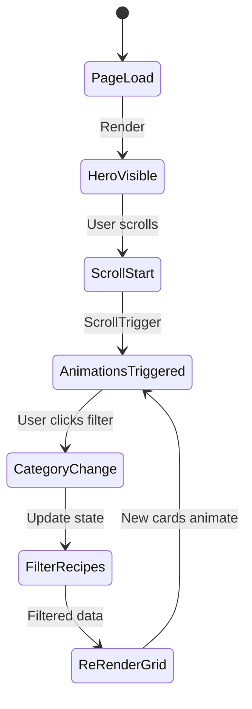

# Design Document: Recetas Page Redesign

## Overview

Este documento detalla la arquitectura técnica y el diseño visual para transformar la página `/recetas` de Ikiwi en una experiencia culinaria inmersiva. El rediseño aplica los mismos principios de storytelling implementados en el homepage: tipografía expresiva con AnimatedTitle, animaciones fluidas con ScrollReveal, transiciones orgánicas entre secciones, y una narrativa visual cohesiva.

La página actual es funcional pero carece del impacto visual y la fluidez del home rediseñado. La transformación mantendrá toda la funcionalidad existente (filtrado, grid de recetas, tips) mientras eleva dramáticamente la experiencia visual.

## Architecture

### Estructura de Componentes

```
┌─────────────────────────────────────────────────────────────┐
│                    /recetas (page.tsx)                       │
├─────────────────────────────────────────────────────────────┤
│  RecetasHero                                                 │
│  ├── Imagen de fondo fullscreen                             │
│  ├── AnimatedTitle "RECETAS"                                │
│  ├── Subtítulo con ScrollReveal                             │
│  └── Scroll indicator animado                               │
├─────────────────────────────────────────────────────────────┤
│  SectionTransition (wave → #faf8f5)                         │
├─────────────────────────────────────────────────────────────┤
│  RecetasDestacadas                                           │
│  ├── Badge + AnimatedTitle                                  │
│  ├── Grid 4 cards (ScrollReveal stagger)                    │
│  └── RecipeCardFeatured × 4                                 │
├─────────────────────────────────────────────────────────────┤
│  SectionTransition (gradient → #f5f0e8)                     │
├─────────────────────────────────────────────────────────────┤
│  RecetasCatalogo                                             │
│  ├── AnimatedTitle "Todas las Recetas"                      │
│  ├── CategoryFilter (tabs/pills)                            │
│  ├── Grid responsive (ScrollReveal stagger)                 │
│  └── RecipeCard × n                                         │
├─────────────────────────────────────────────────────────────┤
│  SectionTransition (wave → verde claro)                     │
├─────────────────────────────────────────────────────────────┤
│  RecetasTips                                                 │
│  ├── Badge + AnimatedTitle                                  │
│  └── Grid 4 tip cards (ScrollReveal stagger)                │
├─────────────────────────────────────────────────────────────┤
│  SectionTransition (organic → #3f7528)                      │
├─────────────────────────────────────────────────────────────┤
│  RecetasCTA                                                  │
│  ├── AnimatedTitle                                          │
│  ├── Descripción                                            │
│  └── Botones CTA                                            │
└─────────────────────────────────────────────────────────────┘
```

### Flujo de Datos



## Components and Interfaces

### 1. RecetasHero

Hero section inmersivo con imagen de fondo y tipografía animada.

```typescript
// Inline en page.tsx o componente separado
interface RecetasHeroProps {
  className?: string;
}

// Estructura interna:
// - Contenedor fullscreen (min-h-screen)
// - Imagen de fondo con overlay
// - AnimatedTitle para "RECETAS"
// - Subtítulo con ScrollReveal
// - Indicador de scroll
```

**Implementación Visual:**
```
┌─────────────────────────────────────────────────────────────┐
│  [Imagen: bg-recipes-kitchen.png con overlay verde/oscuro]  │
│                                                             │
│                                                             │
│              INSPIRACIÓN CULINARIA (badge)                  │
│                                                             │
│                    R E C E T A S                            │
│                   (AnimatedTitle chars)                     │
│                                                             │
│              Descubrí nuevas formas de                      │
│           disfrutar el kiwi argentino                       │
│                                                             │
│                        ↓                                    │
│                   (scroll indicator)                        │
└─────────────────────────────────────────────────────────────┘
```

### 2. RecetasDestacadas

Sección con las 4 recetas más populares.

```typescript
interface RecetasDestacadasProps {
  recipes: Recipe[];
  className?: string;
}

interface Recipe {
  id: number;
  title: string;
  category: string;
  time: string;
  image: string;
  difficulty: string;
  slug?: string;
}
```

**Layout Visual:**
```
┌─────────────────────────────────────────────────────────────┐
│  Fondo: #faf8f5                                             │
│                                                             │
│              ✨ DESTACADAS (badge verde)                    │
│                                                             │
│           LAS MÁS POPULARES                                 │
│           (AnimatedTitle words)                             │
│                                                             │
│  ┌──────────┐ ┌──────────┐ ┌──────────┐ ┌──────────┐       │
│  │          │ │          │ │          │ │          │       │
│  │  Pavlova │ │ Smoothie │ │ Ensalada │ │  Bowl    │       │
│  │          │ │          │ │          │ │          │       │
│  │  45 min  │ │  10 min  │ │  15 min  │ │  10 min  │       │
│  └──────────┘ └──────────┘ └──────────┘ └──────────┘       │
│  (aspect-[3/4], rounded-2xl, shadow-lg)                     │
└─────────────────────────────────────────────────────────────┘
```

### 3. RecipeCardFeatured

Card para recetas destacadas con diseño vertical.

```typescript
interface RecipeCardFeaturedProps {
  recipe: Recipe;
  index: number;
  className?: string;
}
```

**Estructura del Card:**
```
┌─────────────────────┐
│ [Badge: 45 min]     │
│                     │
│    [Imagen]         │
│    aspect-[3/4]     │
│                     │
│ ▓▓▓▓▓▓▓▓▓▓▓▓▓▓▓▓▓▓ │ ← Gradient overlay
│ Pavlova de Kiwi     │
│ Dificultad: Media   │
└─────────────────────┘

Hover:
- scale: 1.1 en imagen
- translate-y: -8px
- shadow: 2xl
- título: text-lime-300
```

### 4. CategoryFilter

Sistema de filtrado por categorías con diseño pill.

```typescript
interface CategoryFilterProps {
  categories: Category[];
  activeCategory: string;
  onCategoryChange: (categoryId: string) => void;
  className?: string;
}

interface Category {
  id: string;
  name: string;
  icon: string; // emoji
}
```

**Diseño Visual:**
```
┌─────────────────────────────────────────────────────────────┐
│                                                             │
│  [🍽️ Todas] [🍰 Postres] [🥤 Bebidas] [🥗 Ensaladas] [🌅 Desayunos]
│                                                             │
│  Activo: bg-[#3f7528] text-white rounded-full              │
│  Inactivo: bg-white text-gray-600 hover:bg-gray-100        │
└─────────────────────────────────────────────────────────────┘
```

### 5. RecipeCard

Card estándar para el grid de todas las recetas.

```typescript
interface RecipeCardProps {
  recipe: Recipe;
  index: number;
  className?: string;
}
```

**Estructura:**
```
┌─────────────────────┐
│ [Badge: 45 min] →   │
│                     │
│    [Imagen]         │
│    aspect-square    │
│                     │
├─────────────────────┤
│ [Postres] (outline) │
│ Pavlova de Kiwi     │
│ Dificultad: Media   │
└─────────────────────┘

Hover:
- imagen scale: 1.1
- translate-y: -8px
- shadow: xl
- título: text-[#3f7528]
```

### 6. TipCard

Card para consejos de cocina.

```typescript
interface TipCardProps {
  tip: Tip;
  index: number;
  className?: string;
}

interface Tip {
  icon: string;
  title: string;
  description: string;
}
```

**Diseño:**
```
┌─────────────────────┐
│                     │
│        🌡️          │
│   (text-4xl)        │
│                     │
│ Maduración Perfecta │
│   (font-bold)       │
│                     │
│ Guarda los kiwis    │
│ junto a manzanas... │
│   (text-sm gray)    │
└─────────────────────┘

Hover: translate-y: -4px, shadow-xl
```

## Data Models

### Datos de Recetas

```typescript
// src/lib/recipes-data.ts
export const categories: Category[] = [
  { id: "todas", name: "Todas", icon: "🍽️" },
  { id: "postres", name: "Postres", icon: "🍰" },
  { id: "bebidas", name: "Bebidas", icon: "🥤" },
  { id: "ensaladas", name: "Ensaladas", icon: "🥗" },
  { id: "desayunos", name: "Desayunos", icon: "🌅" },
];

export const recipes: Recipe[] = [
  {
    id: 1,
    title: "Pavlova de Kiwi",
    category: "postres",
    time: "90 min",
    image: "/recipe-tarta-kiwi.png",
    difficulty: "Media",
  },
  // ... más recetas
];

export const featuredRecipes = recipes.slice(0, 4);

export const tips: Tip[] = [
  {
    icon: "🌡️",
    title: "Maduración Perfecta",
    description: "Guarda los kiwis junto a manzanas o bananas para acelerar la maduración.",
  },
  // ... más tips
];
```

### Configuración de Secciones

```typescript
// Configuración de colores y transiciones por sección
const sectionConfig = {
  hero: {
    background: "bg-recipes-kitchen.png",
    overlay: "from-[#3f7528]/60 via-black/40 to-black/60",
    transitionTo: { variant: "wave", color: "#faf8f5" },
  },
  destacadas: {
    background: "#faf8f5",
    transitionTo: { variant: "gradient", color: "#f5f0e8" },
  },
  catalogo: {
    background: "#f5f0e8",
    transitionTo: { variant: "wave", color: "#e8f5e0" },
  },
  tips: {
    background: "#e8f5e0", // verde muy claro
    transitionTo: { variant: "organic", color: "#3f7528" },
  },
  cta: {
    background: "#3f7528",
  },
};
```

## Visual Design

### Estructura Completa de la Página

```
┌─────────────────────────────────────────────────────────────┐
│ HERO (100vh)                                                │
│ ┌─────────────────────────────────────────────────────────┐ │
│ │  [bg-recipes-kitchen.png + overlay verde/oscuro]        │ │
│ │                                                         │ │
│ │         INSPIRACIÓN CULINARIA                           │ │
│ │              (badge tracking-[0.3em])                   │ │
│ │                                                         │ │
│ │              R E C E T A S                              │ │
│ │         (AnimatedTitle chars, Playfair 7xl)             │ │
│ │                                                         │ │
│ │      Descubrí nuevas formas de disfrutar                │ │
│ │         el kiwi argentino en tu cocina                  │ │
│ │                                                         │ │
│ │                    ↓                                    │ │
│ │              (scroll indicator)                         │ │
│ └─────────────────────────────────────────────────────────┘ │
│ ~~~~~~~~~~~~~ Wave Transition → #faf8f5 ~~~~~~~~~~~~~       │
├─────────────────────────────────────────────────────────────┤
│ DESTACADAS (py-24)                                          │
│ ┌─────────────────────────────────────────────────────────┐ │
│ │  Fondo: #faf8f5                                         │ │
│ │                                                         │ │
│ │              ✨ DESTACADAS                              │ │
│ │           LAS MÁS POPULARES                             │ │
│ │                                                         │ │
│ │  ┌────────┐ ┌────────┐ ┌────────┐ ┌────────┐           │ │
│ │  │ 45min  │ │ 10min  │ │ 15min  │ │ 10min  │           │ │
│ │  │        │ │        │ │        │ │        │           │ │
│ │  │ Pavlova│ │Smoothie│ │Ensalada│ │  Bowl  │           │ │
│ │  │ Media  │ │ Fácil  │ │ Fácil  │ │ Fácil  │           │ │
│ │  └────────┘ └────────┘ └────────┘ └────────┘           │ │
│ │  (grid-cols-2 md:grid-cols-4, gap-4 md:gap-6)          │ │
│ └─────────────────────────────────────────────────────────┘ │
│ ═══════════ Gradient Transition → #f5f0e8 ═══════════       │
├─────────────────────────────────────────────────────────────┤
│ CATÁLOGO (py-24)                                            │
│ ┌─────────────────────────────────────────────────────────┐ │
│ │  Fondo: #f5f0e8                                         │ │
│ │                                                         │ │
│ │           TODAS LAS RECETAS                             │ │
│ │                                                         │ │
│ │  [🍽️ Todas] [🍰 Postres] [🥤 Bebidas] [🥗] [🌅]         │ │
│ │                                                         │ │
│ │  ┌──────┐ ┌──────┐ ┌──────┐ ┌──────┐                   │ │
│ │  │      │ │      │ │      │ │      │                   │ │
│ │  │      │ │      │ │      │ │      │                   │ │
│ │  └──────┘ └──────┘ └──────┘ └──────┘                   │ │
│ │  ┌──────┐ ┌──────┐ ┌──────┐ ┌──────┐                   │ │
│ │  │      │ │      │ │      │ │      │                   │ │
│ │  │      │ │      │ │      │ │      │                   │ │
│ │  └──────┘ └──────┘ └──────┘ └──────┘                   │ │
│ │  (grid-cols-2 md:grid-cols-3 lg:grid-cols-4)           │ │
│ └─────────────────────────────────────────────────────────┘ │
│ ~~~~~~~~~~~~~ Wave Transition → #e8f5e0 ~~~~~~~~~~~~~       │
├─────────────────────────────────────────────────────────────┤
│ TIPS (py-24)                                                │
│ ┌─────────────────────────────────────────────────────────┐ │
│ │  Fondo: #e8f5e0 (verde muy claro)                       │ │
│ │                                                         │ │
│ │              🥝 TIPS DE COCINA                          │ │
│ │      CONSEJOS PARA COCINAR CON KIWI                     │ │
│ │                                                         │ │
│ │  ┌──────────┐ ┌──────────┐ ┌──────────┐ ┌──────────┐   │ │
│ │  │    🌡️    │ │    🧊    │ │    🥛    │ │    🍖    │   │ │
│ │  │Maduración│ │Conserva- │ │ Lácteos  │ │Marinadas │   │ │
│ │  │ Perfecta │ │   ción   │ │          │ │          │   │ │
│ │  │  desc... │ │  desc... │ │  desc... │ │  desc... │   │ │
│ │  └──────────┘ └──────────┘ └──────────┘ └──────────┘   │ │
│ │  (grid md:grid-cols-2 lg:grid-cols-4)                   │ │
│ └─────────────────────────────────────────────────────────┘ │
│ ═══════════ Organic Transition → #3f7528 ═══════════        │
├─────────────────────────────────────────────────────────────┤
│ CTA FINAL (py-24)                                           │
│ ┌─────────────────────────────────────────────────────────┐ │
│ │  Fondo: #3f7528                                         │ │
│ │                                                         │ │
│ │                    🥝                                   │ │
│ │                                                         │ │
│ │        ¿TENÉS UNA RECETA CON KIWI?                     │ │
│ │                                                         │ │
│ │     Compartila con nosotros en Instagram                │ │
│ │          y etiquetanos @kiwi_argentino                  │ │
│ │                                                         │ │
│ │  [SEGUINOS EN INSTAGRAM]  [VER PRODUCTOS]               │ │
│ │   (bg-white text-green)    (outline white)              │ │
│ └─────────────────────────────────────────────────────────┘ │
└─────────────────────────────────────────────────────────────┘
```

### Paleta de Colores

| Color | Hex | Uso |
|-------|-----|-----|
| Canopy Green | #3f7528 | CTA backgrounds, badges activos, acentos |
| Cream | #faf8f5 | Fondo sección destacadas |
| Warm Cream | #f5f0e8 | Fondo sección catálogo |
| Light Green | #e8f5e0 | Fondo sección tips |
| Lime Accent | #8DC54D | Hover states, highlights |
| Text Dark | #1a1a1a | Títulos principales |
| Text Gray | #6b7280 | Texto secundario |

### Tipografía

- **Títulos principales**: `font-[family-name:var(--font-playfair)]` - Bold/Black
- **Badges/Labels**: Sans-serif, tracking-[0.3em], uppercase, text-sm
- **Cuerpo**: Geist Sans (default)
- **Datos**: Geist Sans medium

### Animaciones

#### Hero Title (chars)
```
Delay: 0s
Duration: 0.8s per char
Stagger: 0.03s
Ease: power3.out

R → E → C → E → T → A → S
```

#### Section Titles (words)
```
Delay: 0s
Duration: 0.8s per word
Stagger: 0.1s
Ease: power3.out

LAS → MÁS → POPULARES
```

#### Cards (fadeUp + stagger)
```
Initial: { y: 50, opacity: 0 }
Final: { y: 0, opacity: 1 }
Duration: 0.8s
Stagger: 0.1s (entre cards)
Trigger: top 80%
```

#### Card Hover
```
Transform: translateY(-8px)
Shadow: 0 25px 50px -12px rgba(0, 0, 0, 0.25)
Image Scale: 1.1
Duration: 0.5s
Ease: ease-out
```

## Error Handling

### Fallbacks

1. **Sin JavaScript**: Todo el contenido visible, sin animaciones
2. **Reduced Motion**: Detectar preferencia y desactivar animaciones
3. **Imágenes fallidas**: Mostrar placeholder con color de fondo
4. **Filtro vacío**: Mostrar mensaje "No hay recetas en esta categoría"

```typescript
// Detección de preferencias
const prefersReducedMotion = typeof window !== 'undefined' 
  ? window.matchMedia('(prefers-reduced-motion: reduce)').matches 
  : false;

// Fallback para filtro vacío
{filteredRecipes.length === 0 && (
  <div className="text-center py-12">
    <p className="text-gray-500">No hay recetas en esta categoría</p>
  </div>
)}
```

### Estados de Carga

- Imágenes: Usar `placeholder="blur"` con blurDataURL
- Contenido: Visible inmediatamente (SSR)

## Testing Strategy

### Tests Visuales

1. Verificar animaciones en Chrome DevTools
2. Snapshot tests de cada sección
3. Test en diferentes breakpoints (375px, 768px, 1024px, 1440px)

### Tests de Accesibilidad

1. Contraste de colores (WCAG AA)
2. Navegación por teclado
3. Screen reader compatibility
4. Alt text en imágenes

### Tests de Performance

1. Lighthouse score > 90
2. LCP < 2.5s
3. CLS < 0.1
4. Verificar lazy loading de imágenes

### Tests Funcionales

1. Filtrado de categorías funciona correctamente
2. Hover states se aplican
3. Links navegan correctamente
4. Animaciones respetan reduced-motion

## Implementation Notes

### Archivos a Modificar/Crear

```
src/
├── app/
│   └── recetas/
│       └── page.tsx          # MODIFICAR - Rediseño completo
└── lib/
    └── recipes-data.ts       # CREAR (opcional) - Datos centralizados
```

### Componentes Reutilizados del Home

- `ScrollReveal` - Para animaciones de entrada
- `AnimatedTitle` - Para títulos con reveal
- `SectionTransition` - Para transiciones entre secciones
- `Button` - Para CTAs

### Consideraciones de Performance

1. Usar `priority` en imagen del hero
2. Lazy load en imágenes del grid
3. Optimizar imágenes a WebP
4. Limitar número de animaciones simultáneas

### Orden de Implementación Sugerido

1. Hero section con AnimatedTitle
2. Sección destacadas con cards
3. Sistema de filtrado
4. Grid de catálogo
5. Sección de tips
6. CTA final
7. Transiciones entre secciones
8. Pulido de animaciones y responsive
