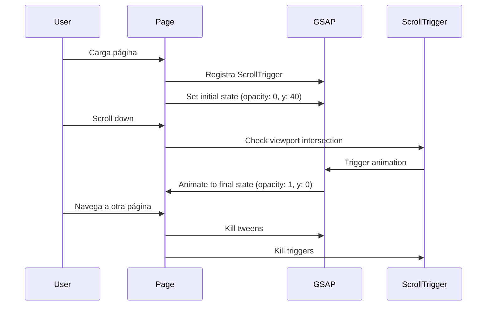
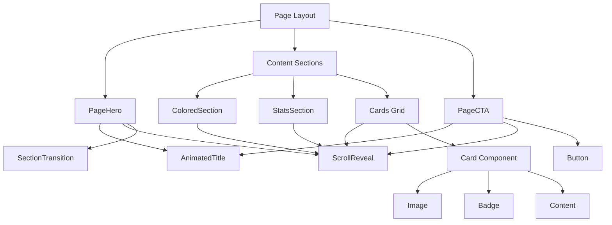

# Design Document: Rediseño de Páginas Internas iKiwi

## Overview

Este documento detalla la arquitectura técnica y el diseño de componentes para rediseñar todas las páginas internas del sitio web de iKiwi, aplicando el sistema de diseño premium implementado en el home. El rediseño abarca 7 páginas: Productos, Nosotros, Nutrición, Recetas, Noticias, Contacto y Trabaja con Nosotros.

## Architecture

### Estructura de Componentes

```
src/
├── components/
│   ├── animations/           # Componentes de animación existentes
│   │   ├── animated-title.tsx
│   │   ├── scroll-reveal.tsx
│   │   ├── parallax-image.tsx
│   │   └── section-transition.tsx
│   ├── sections/             # Secciones reutilizables
│   │   ├── page-hero.tsx          # NUEVO: Hero genérico para páginas
│   │   ├── stats-section.tsx      # NUEVO: Sección de estadísticas
│   │   ├── colored-section.tsx    # NUEVO: Sección con fondo de color
│   │   └── page-cta.tsx           # NUEVO: CTA final de página
│   └── ui/                   # Componentes UI base (existentes)
├── app/
│   ├── productos/page.tsx    # Rediseñar
│   ├── nosotros/page.tsx     # Rediseñar
│   ├── nutricion/page.tsx    # Rediseñar
│   ├── recetas/page.tsx      # Rediseñar
│   ├── noticias/page.tsx     # Rediseñar
│   ├── contacto/page.tsx     # Rediseñar
│   └── trabaja-con-nosotros/page.tsx  # Rediseñar
```


### Design System Tokens

```typescript
// Colores principales
const colors = {
  primary: '#3f7528',        // Verde iKiwi
  primaryHover: '#4a8a30',   // Verde hover
  primaryDark: '#1a3311',    // Verde oscuro
  primaryLight: '#3f7528/10', // Verde transparente
  
  lime: {
    300: 'lime-300',         // Acentos en fondos oscuros
    400: 'lime-400',         // Badges y highlights
  },
  
  backgrounds: {
    cream: '#faf8f5',        // Fondo principal claro
    beige: '#f5f0e8',        // Fondo secundario
    white: '#ffffff',        // Cards y contenedores
  },
  
  text: {
    primary: 'gray-900',     // Títulos
    secondary: 'gray-600',   // Párrafos
    muted: 'gray-500',       // Texto secundario
  }
};

// Espaciados de sección
const sectionSpacing = {
  default: 'py-24 md:py-32',
  compact: 'py-16 md:py-24',
  hero: 'py-20 md:py-28',
};

// Bordes redondeados
const borderRadius = {
  card: 'rounded-2xl',
  cardLarge: 'rounded-3xl',
  button: 'rounded-full',
  badge: 'rounded-full',
};

// Sombras
const shadows = {
  card: 'shadow-lg hover:shadow-2xl',
  button: 'shadow-xl hover:shadow-2xl',
  floating: 'shadow-2xl',
};

// Transiciones
const transitions = {
  default: 'transition-all duration-300',
  slow: 'transition-all duration-500',
  transform: 'transition-transform duration-700',
};
```

## Components and Interfaces

### 1. PageHero Component

```typescript
// src/components/sections/page-hero.tsx
interface PageHeroProps {
  badge?: string;                    // Texto del badge superior
  title: string;                     // Título principal (se anima)
  titleHighlight?: string;           // Parte del título en color diferente
  subtitle?: string;                 // Subtítulo descriptivo
  description?: string;              // Descripción adicional
  backgroundImage?: string;          // URL de imagen de fondo
  backgroundColor?: 'green' | 'cream' | 'beige' | 'dark';
  showStats?: boolean;               // Mostrar estadísticas
  stats?: Array<{
    value: string;
    label: string;
    description?: string;
  }>;
  children?: React.ReactNode;        // Contenido adicional
  className?: string;
}
```

**Implementación Visual:**
- Fondo con imagen + overlay gradiente o color sólido
- Badge superior con tracking-[0.3em] uppercase
- Título con AnimatedTitle (animation="words")
- Subtítulo con ScrollReveal (animation="fadeUp")
- Stats en grid con números grandes en color primario
- SectionTransition al final

### 2. StatsSection Component

```typescript
// src/components/sections/stats-section.tsx
interface StatsSectionProps {
  stats: Array<{
    value: string;
    label: string;
    description?: string;
    icon?: string;
  }>;
  variant?: 'inline' | 'cards' | 'floating';
  columns?: 2 | 3 | 4;
  className?: string;
}
```

**Variantes:**
- `inline`: Stats en fila horizontal con separadores
- `cards`: Stats en cards individuales con sombra
- `floating`: Stats en contenedor flotante sobre imagen

### 3. ColoredSection Component

```typescript
// src/components/sections/colored-section.tsx
interface ColoredSectionProps {
  backgroundColor: 'green' | 'cream' | 'beige' | 'dark';
  backgroundImage?: string;
  backgroundOpacity?: number;
  children: React.ReactNode;
  transition?: 'wave' | 'organic' | 'gradient' | 'none';
  transitionTo?: string;
  className?: string;
}
```

### 4. PageCTA Component

```typescript
// src/components/sections/page-cta.tsx
interface PageCTAProps {
  icon?: string;
  title: string;
  description: string;
  primaryButton?: {
    text: string;
    href: string;
  };
  secondaryButton?: {
    text: string;
    href: string;
  };
  variant?: 'green' | 'cream' | 'dark';
  showCertifications?: boolean;
  className?: string;
}
```


## Data Models

### Página de Productos

```typescript
interface KiwiVariety {
  id: string;
  name: string;
  variety: string;
  tagline: string;
  description: string;
  longDescription: string;
  color: string;           // Gradiente CSS
  pulpColor: string;
  skinColor: string;
  centerColor?: string;    // Para kiwi rojo
  badge: string;
  characteristics: Array<{ label: string; value: string }>;
  nutrition: Array<{ nutrient: string; value: string; percent: string }>;
  uses: string[];
}

interface Certification {
  name: string;
  description: string;
  image: string;
  external?: boolean;
}
```

### Página de Nosotros

```typescript
interface TimelineEvent {
  year: string;
  title: string;
  description: string;
  image?: string;
}

interface CompanyValue {
  icon: string;
  title: string;
  description: string;
}

interface TerroirFeature {
  icon: string;
  title: string;
  description: string;
}
```

### Página de Nutrición

```typescript
interface NutritionalFact {
  nutrient: string;
  value: string;
  unit: string;
  dailyValue?: string;
}

interface HealthBenefit {
  icon: string;
  title: string;
  description: string;
  detail: string;
  color: string;
}

interface VitaminComparison {
  fruit: string;
  amount: string;
  percentage: number;
  icon: string;
}

interface FAQ {
  question: string;
  answer: string;
}
```

### Página de Recetas

```typescript
interface Recipe {
  id: number;
  title: string;
  category: 'postres' | 'bebidas' | 'ensaladas' | 'desayunos';
  difficulty: 'Fácil' | 'Media' | 'Avanzada';
  time: string;
  servings: string;
  description: string;
  image: string;
  ingredients: string[];
  steps: string[];
  tips: string;
}

interface RecipeCategory {
  id: string;
  name: string;
  icon: string;
}
```

### Página de Noticias

```typescript
interface NewsArticle {
  id: number;
  title: string;
  date: string;
  sortDate: string;
  category: string;
  excerpt: string;
  content?: string;
  image: string | null;
  imageAlt: string;
  imagePlaceholder?: string;
  link: string;
  featured?: boolean;
}

interface IndustryStat {
  value: string;
  label: string;
  description: string;
}

interface PressLogo {
  name: string;
  logo: string;
}
```

### Página de Contacto

```typescript
interface ContactOption {
  icon: React.ReactNode;
  title: string;
  description: string;
  href: string;
  variant: 'light' | 'dark';
}

interface ContactInfo {
  icon: string;
  title: string;
  lines: string[];
}

interface ContactReason {
  icon: string;
  title: string;
  description: string;
}
```

### Página de Trabaja con Nosotros

```typescript
interface WorkArea {
  icon: string;
  title: string;
  description: string;
  tasks: string[];
  season: string;
}

interface WorkBenefit {
  icon: string;
  title: string;
  description: string;
}
```


## Diseño Visual por Página

### Página de Productos (/productos)

```
┌─────────────────────────────────────────────────────────────┐
│ HERO SECTION (bg: gradient green)                           │
│ ┌─────────────────────────────────────────────────────────┐ │
│ │ Badge: "VARIEDADES PREMIUM CERTIFICADAS"                │ │
│ │ Title: "NUESTROS KIWIS" (AnimatedTitle)                 │ │
│ │ Subtitle: "Cada variedad es única. Todas deliciosas."   │ │
│ └─────────────────────────────────────────────────────────┘ │
│ SectionTransition (wave → cream)                            │
├─────────────────────────────────────────────────────────────┤
│ GRID DE VARIEDADES (bg: cream)                              │
│ ┌─────────┐ ┌─────────┐ ┌─────────┐ ┌─────────┐ ┌─────────┐ │
│ │ VERDE   │ │ GOLD    │ │ ROJO    │ │ORGÁNICO │ │ BABY    │ │
│ │ Hayward │ │ Jingold │ │ Passion │ │ Certif. │ │ Kiwiber │ │
│ │ [img]   │ │ [img]   │ │ [img]   │ │ [img]   │ │ [img]   │ │
│ │ desc... │ │ desc... │ │ desc... │ │ desc... │ │ desc... │ │
│ └─────────┘ └─────────┘ └─────────┘ └─────────┘ └─────────┘ │
│ (ScrollReveal staggered)                                    │
├─────────────────────────────────────────────────────────────┤
│ CERTIFICACIONES (bg: white/blur card)                       │
│ ┌─────────────────────────────────────────────────────────┐ │
│ │ [IG] [GlobalGAP] [USDA] [UE]                            │ │
│ │ "🌿 Primer kiwi argentino con IG Mar y Sierras"         │ │
│ └─────────────────────────────────────────────────────────┘ │
├─────────────────────────────────────────────────────────────┤
│ CALENDARIO DE TEMPORADA                                     │
│ [E][F][M][A][M][J][J][A][S][O][N][D]                        │
│        ████████████████████                                 │
│ "🥝 Kiwi fresco de mayo a octubre"                          │
├─────────────────────────────────────────────────────────────┤
│ CTA FINAL                                                   │
│ [VER TODOS LOS PRODUCTOS] (rounded-full, green)             │
└─────────────────────────────────────────────────────────────┘
```

### Página de Nosotros (/nosotros)

```
┌─────────────────────────────────────────────────────────────┐
│ HERO SECTION (bg: image + overlay)                          │
│ ┌─────────────────────────────────────────────────────────┐ │
│ │ Badge: "NUESTRA HISTORIA"                               │ │
│ │ Title: "LA MAYOR PRODUCTORA DE KIWI DE ARGENTINA"       │ │
│ │ Stats: [270+ Ha] [90+ Emp] [4 Países] [2006]            │ │
│ └─────────────────────────────────────────────────────────┘ │
│ SectionTransition (wave → cream)                            │
├─────────────────────────────────────────────────────────────┤
│ TERROIR SECTION (bg: green/10)                              │
│ ┌─────────────────────────────────────────────────────────┐ │
│ │ Title: "El Terroir: Mar y Sierras"                      │ │
│ │ ┌──────────────┐ ┌──────────────┐                       │ │
│ │ │ 🌍 Ubicación │ │ 🌱 Suelos    │                       │ │
│ │ └──────────────┘ └──────────────┘                       │ │
│ │ ┌──────────────┐ ┌──────────────┐                       │ │
│ │ │ 🌡️ Clima     │ │ ⭐ Calidad   │                       │ │
│ │ └──────────────┘ └──────────────┘                       │ │
│ └─────────────────────────────────────────────────────────┘ │
├─────────────────────────────────────────────────────────────┤
│ ORIGEN STORY (2 columns)                                    │
│ ┌─────────────────────┐ ┌─────────────────────┐             │
│ │ [Texto historia]    │ │ [Imagen parallax]   │             │
│ │ Luis Franch...      │ │ Badge: "Desde 2006" │             │
│ └─────────────────────┘ └─────────────────────┘             │
├─────────────────────────────────────────────────────────────┤
│ VARIEDADES (3 cards)                                        │
│ ┌─────────┐ ┌─────────┐ ┌─────────┐                         │
│ │ 🥝 Verde│ │ 🟡 Gold │ │ ❤️ Rojo │                         │
│ │ Hayward │ │ Jintao  │ │ Experim │                         │
│ └─────────┘ └─────────┘ └─────────┘                         │
├─────────────────────────────────────────────────────────────┤
│ TIMELINE (alternating left/right)                           │
│     2006 ●─────────────────────────────────────             │
│          │ El Nacimiento                                    │
│ ─────────● 2010                                             │
│            Expansión Inicial │                              │
│     2015 ●─────────────────────────────────────             │
│          │ Convenio Bologna                                 │
│ ... (continúa hasta 2025)                                   │
├─────────────────────────────────────────────────────────────┤
│ VALORES (4 cards)                                           │
│ [🌱 Sustentabilidad] [⭐ Calidad] [🤝 Comunidad] [🔬 Innov] │
├─────────────────────────────────────────────────────────────┤
│ EMPAQUETADORA (full-width component existente)              │
├─────────────────────────────────────────────────────────────┤
│ CERTIFICACIONES (component existente)                       │
├─────────────────────────────────────────────────────────────┤
│ SUSTENTABILIDAD (bg: green/10)                              │
│ 🌍 Compromiso con la Sustentabilidad                        │
│ [🌱 Orgánico] [💧 Agua] [🚚 Km 0]                           │
└─────────────────────────────────────────────────────────────┘
```


### Página de Nutrición (/nutricion)

```
┌─────────────────────────────────────────────────────────────┐
│ HERO SECTION (bg: green #3f7528)                            │
│ ┌─────────────────────────────────────────────────────────┐ │
│ │ Badge: "NUTRICIÓN & SALUD" (lime-300)                   │ │
│ │ Title: "1 KIWI = 1 KILO DE LIMONES" (white)             │ │
│ │ Subtitle: "en Vitamina C" (lime-300, text-3xl)          │ │
│ │ Decorative blurs (lime-400/20, white/10)                │ │
│ └─────────────────────────────────────────────────────────┘ │
│ SectionTransition (wave → cream)                            │
├─────────────────────────────────────────────────────────────┤
│ COMPARACIÓN VITAMINA C (bg: cream)                          │
│ ┌─────────────────────────────────────────────────────────┐ │
│ │ 🥝 Kiwi Verde    ████████████████████████████ 92.7mg    │ │
│ │ 🍊 Naranja       ██████████████               53.2mg    │ │
│ │ 🍓 Frutilla      ███████████████              58.8mg    │ │
│ │ 🍋 Limón         ██████████████               53mg      │ │
│ │ 🍎 Manzana       ██                           4.6mg     │ │
│ └─────────────────────────────────────────────────────────┘ │
├─────────────────────────────────────────────────────────────┤
│ BENEFICIOS GRID (2x3 cards)                                 │
│ ┌─────────┐ ┌─────────┐ ┌─────────┐                         │
│ │💪 Inmune│ │🫁 Digest│ │❤️ Cardio│                         │
│ │ [grad]  │ │ [grad]  │ │ [grad]  │                         │
│ └─────────┘ └─────────┘ └─────────┘                         │
│ ┌─────────┐ ┌─────────┐ ┌─────────┐                         │
│ │😴 Sueño │ │👀 Visual│ │🦴 Huesos│                         │
│ │ [grad]  │ │ [grad]  │ │ [grad]  │                         │
│ └─────────┘ └─────────┘ └─────────┘                         │
├─────────────────────────────────────────────────────────────┤
│ TABLA NUTRICIONAL (card centered)                           │
│ ┌─────────────────────────────────────────────────────────┐ │
│ │ Por cada 100g de kiwi verde                             │ │
│ │ Calorías ............................ 61 kcal           │ │
│ │ Vitamina C .......................... 92.7mg (103% VD)  │ │
│ │ Fibra ............................... 3g                │ │
│ │ ...                                                     │ │
│ └─────────────────────────────────────────────────────────┘ │
├─────────────────────────────────────────────────────────────┤
│ ACTINIDINA SECTION (bg: green/10)                           │
│ ┌─────────────────────────────────────────────────────────┐ │
│ │ 🧬 Actinidina: La Enzima Única del Kiwi                 │ │
│ │ ┌──────────────┐ ┌──────────────┐                       │ │
│ │ │ ¿Qué es?     │ │ Beneficios   │                       │ │
│ │ │ [texto]      │ │ ✓ Digestión  │                       │ │
│ │ │              │ │ ✓ Hinchazón  │                       │ │
│ │ │              │ │ ✓ Postre     │                       │ │
│ │ │              │ │ ✓ Marinadas  │                       │ │
│ │ └──────────────┘ └──────────────┘                       │ │
│ └─────────────────────────────────────────────────────────┘ │
├─────────────────────────────────────────────────────────────┤
│ VERDE VS AMARILLO (2 cards side by side)                    │
│ ┌─────────────────────┐ ┌─────────────────────┐             │
│ │ 🥝 KIWI VERDE       │ │ 🟡 KIWI AMARILLO    │             │
│ │ border-green        │ │ border-amber        │             │
│ │ [imagen]            │ │ [imagen]            │             │
│ │ Vit C: 92.7mg       │ │ Vit C: 161mg ⬆️     │             │
│ │ Fibra: 3g ⬆️        │ │ Fibra: 2g           │             │
│ │ Actinidina: Alta ⬆️ │ │ Actinidina: Mod     │             │
│ └─────────────────────┘ └─────────────────────┘             │
├─────────────────────────────────────────────────────────────┤
│ FAQs (Accordion)                                            │
│ ▶ ¿Cuántos kiwis puedo comer al día?                        │
│ ▶ ¿El kiwi amarillo tiene los mismos beneficios?            │
│ ▶ ¿Se puede comer la piel del kiwi?                         │
│ ▶ ...                                                       │
├─────────────────────────────────────────────────────────────┤
│ CTA FINAL (bg: green/10)                                    │
│ 🥝 Incorpora el Kiwi a Tu Dieta                             │
│ [DESCUBRÍ TODOS LOS BENEFICIOS]                             │
└─────────────────────────────────────────────────────────────┘
```

### Página de Recetas (/recetas)

```
┌─────────────────────────────────────────────────────────────┐
│ HERO SECTION (bg: cream)                                    │
│ ┌─────────────────────────────────────────────────────────┐ │
│ │ Badge: "INSPIRACIÓN CULINARIA"                          │ │
│ │ Title: "RECETAS DELICIOSAS" (AnimatedTitle)             │ │
│ │ Subtitle: "Ideas frescas para cada momento del día"     │ │
│ └─────────────────────────────────────────────────────────┘ │
├─────────────────────────────────────────────────────────────┤
│ RECETAS DESTACADAS (4 cards aspect-[3/4])                   │
│ ┌─────────┐ ┌─────────┐ ┌─────────┐ ┌─────────┐             │
│ │ [img]   │ │ [img]   │ │ [img]   │ │ [img]   │             │
│ │ Pavlova │ │ Smoothie│ │ Limonada│ │ Salmón  │             │
│ │ 45 min  │ │ 10 min  │ │ 15 min  │ │ 30 min  │             │
│ └─────────┘ └─────────┘ └─────────┘ └─────────┘             │
│ (hover: scale-110 img, -translate-y-2 card)                 │
├─────────────────────────────────────────────────────────────┤
│ FILTROS POR CATEGORÍA (Tabs)                                │
│ [Todas] [🍰 Postres] [🥤 Bebidas] [🥗 Ensaladas] [🌅 Desay] │
├─────────────────────────────────────────────────────────────┤
│ GRID DE RECETAS (filtrado)                                  │
│ ┌─────────┐ ┌─────────┐ ┌─────────┐ ┌─────────┐             │
│ │ Recipe  │ │ Recipe  │ │ Recipe  │ │ Recipe  │             │
│ │ Card    │ │ Card    │ │ Card    │ │ Card    │             │
│ └─────────┘ └─────────┘ └─────────┘ └─────────┘             │
├─────────────────────────────────────────────────────────────┤
│ RECETAS DETALLADAS (expandible o scroll-to)                 │
│ ┌─────────────────────────────────────────────────────────┐ │
│ │ PAVLOVA DE KIWI                                         │ │
│ │ [Postres] [Media] [90 min] [8 porciones]                │ │
│ │ ┌──────────────┐ ┌──────────────┐                       │ │
│ │ │ 🥝 Ingredien │ │ 👨‍🍳 Preparac │                       │ │
│ │ │ • 4 claras   │ │ 1. Precalent │                       │ │
│ │ │ • 250g azúc  │ │ 2. Batir cla │                       │ │
│ │ │ • ...        │ │ 3. ...       │                       │ │
│ │ └──────────────┘ └──────────────┘                       │ │
│ │ 💡 Tip: Usa kiwis bien maduros...                       │ │
│ └─────────────────────────────────────────────────────────┘ │
├─────────────────────────────────────────────────────────────┤
│ CONSEJOS (bg: green/10)                                     │
│ ┌─────────┐ ┌─────────┐ ┌─────────┐ ┌─────────┐             │
│ │🌡️ Madur │ │🧊 Conser│ │🥛 Lácteo│ │🍖 Marina│             │
│ └─────────┘ └─────────┘ └─────────┘ └─────────┘             │
└─────────────────────────────────────────────────────────────┘
```


### Página de Noticias (/noticias)

```
┌─────────────────────────────────────────────────────────────┐
│ HERO SECTION (bg: cream)                                    │
│ ┌─────────────────────────────────────────────────────────┐ │
│ │ Badge: "NOTICIAS"                                       │ │
│ │ Title: "NOVEDADES DE IKIWI" (AnimatedTitle)             │ │
│ │ Subtitle: "Mantente informado sobre nuestros logros"    │ │
│ └─────────────────────────────────────────────────────────┘ │
├─────────────────────────────────────────────────────────────┤
│ NOTICIA DESTACADA (bg: green/10, 2 columns)                 │
│ ┌─────────────────────────────────────────────────────────┐ │
│ │ ┌──────────────────┐ ┌──────────────────┐               │ │
│ │ │ [Entrevista]     │ │ [IMAGEN]         │               │ │
│ │ │ 17 Feb 2017      │ │ Luis Franch      │               │ │
│ │ │ "Aspiramos a     │ │ Representante    │               │ │
│ │ │ tener la misma   │ │ & Fundador       │               │ │
│ │ │ calidad..."      │ │                  │               │ │
│ │ │ [Leer más →]     │ │                  │               │ │
│ │ └──────────────────┘ └──────────────────┘               │ │
│ └─────────────────────────────────────────────────────────┘ │
├─────────────────────────────────────────────────────────────┤
│ GRID DE NOTICIAS (3 columns)                                │
│ ┌─────────┐ ┌─────────┐ ┌─────────┐                         │
│ │ [img]   │ │ [img]   │ │ [img]   │                         │
│ │ CoopeKi │ │ Export  │ │ Mar y   │                         │
│ │ 2024    │ │ IG 2023 │ │ Sierras │                         │
│ └─────────┘ └─────────┘ └─────────┘                         │
│ ┌─────────┐ ┌─────────┐ ┌─────────┐                         │
│ │ [img]   │ │ 🏅      │ │ [img]   │                         │
│ │ Mejores │ │ Resol.  │ │ Miramar │                         │
│ │ 2023    │ │ 2022    │ │ 2021    │                         │
│ └─────────┘ └─────────┘ └─────────┘                         │
│ (ScrollReveal staggered, hover: text-[#3f7528])             │
├─────────────────────────────────────────────────────────────┤
│ ESTADÍSTICAS (4 cards)                                      │
│ ┌─────────┐ ┌─────────┐ ┌─────────┐ ┌─────────┐             │
│ │ 0,45kg  │ │ 9       │ │ 16,5%   │ │ 900t    │             │
│ │ Per Cáp │ │ Partidos│ │ Mat Seca│ │ Capacid │             │
│ └─────────┘ └─────────┘ └─────────┘ └─────────┘             │
├─────────────────────────────────────────────────────────────┤
│ EN LOS MEDIOS (bg: beige)                                   │
│ ┌─────────────────────────────────────────────────────────┐ │
│ │ [La Nación] [Clarín] [Infobae] (grayscale hover)        │ │
│ │                                                         │ │
│ │ ┌─────────────────────────────────────────────────────┐ │ │
│ │ │ "Lo que empezó como una inversión de un abogado..." │ │ │
│ │ │ — Diario La Nación, 2019                            │ │ │
│ │ └─────────────────────────────────────────────────────┘ │ │
│ └─────────────────────────────────────────────────────────┘ │
├─────────────────────────────────────────────────────────────┤
│ CTA INSTAGRAM                                               │
│ 📱 Seguir en Instagram                                      │
└─────────────────────────────────────────────────────────────┘
```

### Página de Contacto (/contacto)

```
┌─────────────────────────────────────────────────────────────┐
│ HERO SECTION (bg: green + image)                            │
│ ┌─────────────────────────────────────────────────────────┐ │
│ │ Badge: "CONECTÁ CON NOSOTROS" (lime-300)                │ │
│ │ Title: "¿LISTO PARA PROBAR EL MEJOR KIWI?" (white)      │ │
│ │ Subtitle: "Kiwis premium con certificación de origen"   │ │
│ └─────────────────────────────────────────────────────────┘ │
├─────────────────────────────────────────────────────────────┤
│ OPCIONES DE CONTACTO (3 cards)                              │
│ ┌─────────────────┐ ┌─────────────────┐ ┌─────────────────┐ │
│ │ 🛒 DÓNDE COMPRAR│ │ 💼 EMPRESAS B2B │ │ 💬 CONTACTANOS  │ │
│ │ (white card)    │ │ (dark card)     │ │ (white card)    │ │
│ │ Encontrá kiwis  │ │ Restaurantes,   │ │ Consultas,      │ │
│ │ frescos cerca   │ │ supermercados   │ │ sugerencias     │ │
│ │ [Ver puntos →]  │ │ [Comercial →]   │ │ [Mensaje →]     │ │
│ └─────────────────┘ └─────────────────┘ └─────────────────┘ │
├─────────────────────────────────────────────────────────────┤
│ CONTACTO DIRECTO (2 columns)                                │
│ ┌─────────────────────────┐ ┌─────────────────────────┐     │
│ │ [WhatsApp] #25D366      │ │ [Email] white/10        │     │
│ │ Respuesta en 24hs       │ │ ventas@ikiwi.com.ar     │     │
│ └─────────────────────────┘ └─────────────────────────┘     │
├─────────────────────────────────────────────────────────────┤
│ CERTIFICACIONES (badges en fila)                            │
│ [IG Mar y Sierras] [GlobalGAP] [USDA Organic] [Export UE]   │
├─────────────────────────────────────────────────────────────┤
│ SectionTransition (wave → cream)                            │
├─────────────────────────────────────────────────────────────┤
│ FORMULARIO DE CONTACTO (bg: cream)                          │
│ ┌─────────────────────────────────────────────────────────┐ │
│ │ ┌──────────────┐ ┌──────────────┐                       │ │
│ │ │ Nombre *     │ │ Email *      │                       │ │
│ │ └──────────────┘ └──────────────┘                       │ │
│ │ ┌──────────────────────────────┐                        │ │
│ │ │ Empresa / Organización       │                        │ │
│ │ └──────────────────────────────┘                        │ │
│ │ ┌──────────────────────────────┐                        │ │
│ │ │ Motivo de Contacto * [▼]     │                        │ │
│ │ └──────────────────────────────┘                        │ │
│ │ ┌──────────────────────────────┐                        │ │
│ │ │ Mensaje *                    │                        │ │
│ │ │                              │                        │ │
│ │ └──────────────────────────────┘                        │ │
│ │ [ENVIAR MENSAJE] (rounded-full)                         │ │
│ └─────────────────────────────────────────────────────────┘ │
├─────────────────────────────────────────────────────────────┤
│ MAPA (Google Maps iframe)                                   │
│ ┌─────────────────────────────────────────────────────────┐ │
│ │ [MAPA INTERACTIVO]                                      │ │
│ │ Sierra de los Padres, Mar del Plata                     │ │
│ │ [Ver en Google Maps]                                    │ │
│ └─────────────────────────────────────────────────────────┘ │
├─────────────────────────────────────────────────────────────┤
│ CTA REDES (bg: green/10)                                    │
│ 📸 Instagram @kiwi_argentino                                │
│ [IG Mar y Sierras badge]                                    │
└─────────────────────────────────────────────────────────────┘
```

### Página de Trabaja con Nosotros (/trabaja-con-nosotros)

```
┌─────────────────────────────────────────────────────────────┐
│ HERO SECTION (bg: image + gradient)                         │
│ ┌─────────────────────────────────────────────────────────┐ │
│ │ Badge: "OPORTUNIDADES LABORALES"                        │ │
│ │ Title: "SUMATE AL EQUIPO" (AnimatedTitle)               │ │
│ │ Subtitle: "Más de 90 personas trabajando con pasión"    │ │
│ │ Stats floating: [90+ Emp] [270 Ha] [19 Años]            │ │
│ └─────────────────────────────────────────────────────────┘ │
│ ┌─────────────────────────────────────────────────────────┐ │
│ │ [IMAGEN PARALLAX - Equipo cosechando]                   │ │
│ │ Badge: "Desde 2006"                                     │ │
│ └─────────────────────────────────────────────────────────┘ │
│ SectionTransition (wave → cream)                            │
├─────────────────────────────────────────────────────────────┤
│ ÁREAS DE TRABAJO (3 cards)                                  │
│ ┌─────────────────┐ ┌─────────────────┐ ┌─────────────────┐ │
│ │ 🌱 CAMPO        │ │ 📦 EMPAQUETADORA│ │ 💼 ADMINISTRAT  │ │
│ │ Trabajo al aire │ │ Procesamiento   │ │ Gestión y       │ │
│ │ libre           │ │ y empaque       │ │ soporte         │ │
│ │ • Poda          │ │ • Selección     │ │ • Contabilidad  │ │
│ │ • Cosecha       │ │ • Empaque       │ │ • Ventas        │ │
│ │ • Riego         │ │ • Control       │ │ • RRHH          │ │
│ │ • Control       │ │ • Logística     │ │ • Sistemas      │ │
│ │ ─────────────── │ │ ─────────────── │ │ ─────────────── │ │
│ │ Todo el año     │ │ Mar-Oct         │ │ Todo el año     │ │
│ └─────────────────┘ └─────────────────┘ └─────────────────┘ │
├─────────────────────────────────────────────────────────────┤
│ BENEFICIOS (2x3 grid)                                       │
│ ┌─────────┐ ┌─────────┐ ┌─────────┐                         │
│ │🌿 Natura│ │📈 Crecim│ │👥 Equipo│                         │
│ └─────────┘ └─────────┘ └─────────┘                         │
│ ┌─────────┐ ┌─────────┐ ┌─────────┐                         │
│ │🏠 Estabi│ │🥝 Produc│ │🌍 Impact│                         │
│ └─────────┘ └─────────┘ └─────────┘                         │
├─────────────────────────────────────────────────────────────┤
│ FORMULARIO DE POSTULACIÓN                                   │
│ ┌─────────────────────────────────────────────────────────┐ │
│ │ ┌──────────────┐ ┌──────────────┐                       │ │
│ │ │ Nombre *     │ │ Email *      │                       │ │
│ │ └──────────────┘ └──────────────┘                       │ │
│ │ ┌──────────────┐ ┌──────────────┐                       │ │
│ │ │ Teléfono *   │ │ Área * [▼]   │                       │ │
│ │ └──────────────┘ └──────────────┘                       │ │
│ │ ┌──────────────────────────────┐                        │ │
│ │ │ Contanos sobre vos           │                        │ │
│ │ └──────────────────────────────┘                        │ │
│ │ ┌──────────────────────────────┐                        │ │
│ │ │ Adjuntar CV (PDF) [📎]       │                        │ │
│ │ └──────────────────────────────┘                        │ │
│ │ [ENVIAR POSTULACIÓN] (rounded-full)                     │ │
│ └─────────────────────────────────────────────────────────┘ │
├─────────────────────────────────────────────────────────────┤
│ CTA FINAL (bg: green/10)                                    │
│ 🥝 ¿Tenés Dudas?                                            │
│ [📧 rrhh@ikiwi.com.ar] [📱 Instagram]                       │
└─────────────────────────────────────────────────────────────┘
```


## Error Handling

### Animaciones

1. **Reduced Motion**: Detectar `prefers-reduced-motion` y desactivar animaciones GSAP
```typescript
const prefersReducedMotion = window.matchMedia("(prefers-reduced-motion: reduce)").matches;
if (prefersReducedMotion) {
  gsap.set(elements, { opacity: 1, y: 0 });
  return;
}
```

2. **Fallback de Visibilidad**: Asegurar que el contenido sea visible incluso si las animaciones fallan
```typescript
// En ScrollReveal
style={{ visibility: isVisible ? "visible" : "hidden" }}
```

3. **Cleanup de ScrollTrigger**: Limpiar triggers al desmontar componentes
```typescript
return () => {
  tween.kill();
  ScrollTrigger.getAll().forEach((t) => {
    if (t.trigger === element) t.kill();
  });
};
```

### Imágenes

1. **Fallback para imágenes faltantes**: Usar placeholder o emoji cuando no hay imagen
```typescript
{item.image ? (
  <Image src={item.image} alt={item.imageAlt} fill />
) : (
  <span className="text-6xl">{item.imagePlaceholder}</span>
)}
```

2. **Optimización de carga**: Usar `loading="lazy"` y `sizes` apropiados
```typescript
<Image
  src={item.image}
  alt={item.title}
  fill
  className="object-cover"
  sizes="(max-width: 768px) 100vw, 33vw"
/>
```

### Formularios

1. **Validación client-side**: Usar atributos HTML5 y validación visual
```typescript
<input
  type="email"
  required
  className="... focus:ring-2 focus:ring-[#3f7528] invalid:ring-red-500"
/>
```

2. **Estados de carga**: Mostrar feedback durante envío
```typescript
<Button disabled={isSubmitting}>
  {isSubmitting ? "Enviando..." : "Enviar Mensaje"}
</Button>
```

## Testing Strategy

### Unit Tests

1. **Componentes de Animación**
   - Verificar que AnimatedTitle renderiza correctamente con diferentes props
   - Verificar que ScrollReveal aplica clases correctas según animation type
   - Verificar que SectionTransition renderiza SVG correcto según variant

2. **Componentes Reutilizables**
   - Verificar que PageHero renderiza todos los elementos opcionales
   - Verificar que StatsSection maneja diferentes cantidades de stats
   - Verificar que ColoredSection aplica colores correctos

### Integration Tests

1. **Navegación entre páginas**
   - Verificar que las transiciones de página funcionan correctamente
   - Verificar que el scroll se resetea al cambiar de página

2. **Responsive behavior**
   - Verificar que los grids cambian de columnas en breakpoints
   - Verificar que los títulos cambian de tamaño en móvil

### Visual Regression Tests

1. **Capturas de pantalla por página**
   - Desktop (1920x1080)
   - Tablet (768x1024)
   - Mobile (375x667)

2. **Estados de hover**
   - Cards con hover effect
   - Botones con hover effect
   - Links con color change

### Accessibility Tests

1. **Keyboard navigation**
   - Verificar que todos los elementos interactivos son accesibles con Tab
   - Verificar que el focus es visible

2. **Screen reader**
   - Verificar que las imágenes tienen alt text descriptivo
   - Verificar que los formularios tienen labels asociados

3. **Color contrast**
   - Verificar que el texto tiene suficiente contraste con el fondo
   - Verificar que los estados de focus son visibles

## Diagrama de Flujo de Animaciones



## Diagrama de Componentes



## Consideraciones de Performance

1. **Lazy Loading de Imágenes**
   - Usar `loading="lazy"` en imágenes below the fold
   - Usar `priority` solo en imágenes del hero

2. **Code Splitting**
   - Los componentes de animación usan `"use client"` para client-side rendering
   - Las páginas estáticas pueden ser server-rendered

3. **Optimización de GSAP**
   - Registrar ScrollTrigger una sola vez
   - Usar `will-change: transform` en elementos animados
   - Limpiar animaciones al desmontar

4. **Imágenes Optimizadas**
   - Usar Next.js Image component para optimización automática
   - Definir `sizes` apropiados para responsive images
   - Usar formatos modernos (WebP, AVIF)


## Especificaciones Detalladas de Animaciones

### Timing y Easing

```typescript
// Configuración global de animaciones
const animationConfig = {
  // Duraciones
  duration: {
    fast: 0.3,      // Hover effects, micro-interactions
    normal: 0.6,    // Elementos individuales
    slow: 0.8,      // Títulos, elementos principales
    verySlow: 1.0,  // Hero animations
  },
  
  // Easing functions
  ease: {
    default: "power3.out",      // Suave, profesional
    bounce: "back.out(1.7)",    // Para badges y elementos pequeños
    smooth: "power2.inOut",     // Para transiciones de página
    sharp: "power4.out",        // Para títulos impactantes
  },
  
  // Delays
  delay: {
    badge: 0,           // Primero el badge
    title: 0.1,         // Luego el título
    subtitle: 0.3,      // Después el subtítulo
    content: 0.4,       // Contenido principal
    cta: 0.5,           // Call to action al final
  },
  
  // Stagger (para elementos en grupo)
  stagger: {
    fast: 0.05,         // Cards en grid grande
    normal: 0.1,        // Cards en grid pequeño
    slow: 0.15,         // Elementos destacados
    chars: 0.03,        // Caracteres de título
    words: 0.08,        // Palabras de título
  },
};
```

### Animaciones por Componente

#### AnimatedTitle
```typescript
// Configuración para títulos
const titleAnimations = {
  chars: {
    from: { y: 100, opacity: 0, rotateX: -90 },
    to: { y: 0, opacity: 1, rotateX: 0 },
    duration: 1,
    stagger: 0.03,
    ease: "power4.out",
  },
  words: {
    from: { y: 40, opacity: 0 },
    to: { y: 0, opacity: 1 },
    duration: 0.8,
    stagger: 0.08,
    ease: "power3.out",
  },
  lines: {
    from: { y: 50, opacity: 0 },
    to: { y: 0, opacity: 1 },
    duration: 0.8,
    stagger: 0.1,
    ease: "power3.out",
  },
};
```

#### ScrollReveal
```typescript
// Configuración para revelación en scroll
const scrollRevealAnimations = {
  fadeUp: {
    from: { y: 50, opacity: 0 },
    to: { y: 0, opacity: 1 },
    duration: 0.8,
    ease: "power3.out",
  },
  fadeIn: {
    from: { opacity: 0 },
    to: { opacity: 1 },
    duration: 0.6,
    ease: "power2.out",
  },
  slideLeft: {
    from: { x: 60, opacity: 0 },
    to: { x: 0, opacity: 1 },
    duration: 0.8,
    ease: "power3.out",
  },
  slideRight: {
    from: { x: -60, opacity: 0 },
    to: { x: 0, opacity: 1 },
    duration: 0.8,
    ease: "power3.out",
  },
  scale: {
    from: { scale: 0.9, opacity: 0 },
    to: { scale: 1, opacity: 1 },
    duration: 0.6,
    ease: "back.out(1.7)",
  },
  stagger: {
    from: { y: 30, opacity: 0 },
    to: { y: 0, opacity: 1 },
    duration: 0.6,
    stagger: 0.1,
    ease: "power3.out",
  },
};
```

#### Hover Effects
```typescript
// Configuración para efectos hover
const hoverEffects = {
  card: {
    transform: "translateY(-12px)",  // -translate-y-3
    boxShadow: "0 25px 50px -12px rgba(0, 0, 0, 0.25)",  // shadow-2xl
    transition: "all 0.5s cubic-bezier(0.4, 0, 0.2, 1)",
  },
  cardImage: {
    transform: "scale(1.1)",
    transition: "transform 0.7s cubic-bezier(0.4, 0, 0.2, 1)",
  },
  button: {
    transform: "scale(1.05)",
    boxShadow: "0 25px 50px -12px rgba(0, 0, 0, 0.25)",
    transition: "all 0.3s cubic-bezier(0.4, 0, 0.2, 1)",
  },
  link: {
    color: "#3f7528",
    gap: "12px",  // gap-3
    transition: "all 0.3s ease",
  },
  icon: {
    transform: "scale(1.1)",
    transition: "transform 0.3s ease",
  },
};
```

### ScrollTrigger Configuration
```typescript
// Configuración de ScrollTrigger
const scrollTriggerConfig = {
  default: {
    start: "top 85%",           // Cuando el top del elemento llega al 85% del viewport
    toggleActions: "play none none none",  // Solo play, no reverse
  },
  hero: {
    start: "top top",
    end: "bottom top",
    scrub: true,                // Animación ligada al scroll
  },
  parallax: {
    start: "top bottom",
    end: "bottom top",
    scrub: 0.5,                 // Suavizado del parallax
  },
};
```

## Especificaciones de Responsive Design

### Breakpoints

```typescript
// Breakpoints de Tailwind CSS
const breakpoints = {
  sm: '640px',   // Móvil grande
  md: '768px',   // Tablet
  lg: '1024px',  // Desktop pequeño
  xl: '1280px',  // Desktop
  '2xl': '1536px', // Desktop grande
};
```

### Cambios por Breakpoint

#### Tipografía
```typescript
const typography = {
  // Títulos principales (h1)
  h1: {
    mobile: 'text-4xl',      // 36px
    tablet: 'md:text-5xl',   // 48px
    desktop: 'lg:text-6xl',  // 60px
    large: 'xl:text-7xl',    // 72px
  },
  
  // Títulos de sección (h2)
  h2: {
    mobile: 'text-3xl',      // 30px
    tablet: 'md:text-4xl',   // 36px
    desktop: 'lg:text-5xl',  // 48px
  },
  
  // Subtítulos (h3)
  h3: {
    mobile: 'text-xl',       // 20px
    tablet: 'md:text-2xl',   // 24px
    desktop: 'lg:text-3xl',  // 30px
  },
  
  // Párrafos destacados
  lead: {
    mobile: 'text-lg',       // 18px
    tablet: 'md:text-xl',    // 20px
    desktop: 'lg:text-2xl',  // 24px
  },
  
  // Párrafos normales
  body: {
    mobile: 'text-base',     // 16px
    tablet: 'md:text-lg',    // 18px
  },
};
```

#### Espaciados de Sección
```typescript
const sectionSpacing = {
  hero: {
    mobile: 'py-16',         // 64px
    tablet: 'md:py-24',      // 96px
    desktop: 'lg:py-32',     // 128px
  },
  section: {
    mobile: 'py-16',         // 64px
    tablet: 'md:py-24',      // 96px
    desktop: 'lg:py-32',     // 128px
  },
  compact: {
    mobile: 'py-12',         // 48px
    tablet: 'md:py-16',      // 64px
    desktop: 'lg:py-20',     // 80px
  },
};
```

#### Grids
```typescript
const gridLayouts = {
  // Grid de productos/cards principales
  products: {
    mobile: 'grid-cols-1',
    tablet: 'md:grid-cols-2',
    desktop: 'lg:grid-cols-3',
    gap: 'gap-6 md:gap-8',
  },
  
  // Grid de recetas (4 columnas en desktop)
  recipes: {
    mobile: 'grid-cols-2',
    tablet: 'md:grid-cols-3',
    desktop: 'lg:grid-cols-4',
    gap: 'gap-4 md:gap-6',
  },
  
  // Grid de estadísticas
  stats: {
    mobile: 'grid-cols-2',
    tablet: 'md:grid-cols-4',
    gap: 'gap-4 md:gap-6',
  },
  
  // Grid de beneficios
  benefits: {
    mobile: 'grid-cols-1',
    tablet: 'md:grid-cols-2',
    desktop: 'lg:grid-cols-3',
    gap: 'gap-4 md:gap-6',
  },
  
  // Layout de 2 columnas (hero con imagen)
  twoColumn: {
    mobile: 'grid-cols-1',
    desktop: 'lg:grid-cols-2',
    gap: 'gap-8 lg:gap-12 xl:gap-20',
  },
};
```

#### Imágenes
```typescript
const imageResponsive = {
  // Hero images
  hero: {
    mobile: 'aspect-video',
    tablet: 'md:aspect-[16/9]',
    desktop: 'lg:aspect-[21/9]',
  },
  
  // Card images
  card: {
    mobile: 'h-48',          // 192px
    tablet: 'md:h-56',       // 224px
    desktop: 'lg:h-64',      // 256px
  },
  
  // Recipe cards (aspect ratio)
  recipe: {
    all: 'aspect-[3/4]',
  },
  
  // Parallax images
  parallax: {
    mobile: 'aspect-[4/3]',
    desktop: 'lg:aspect-[16/9]',
  },
};
```

#### Elementos Ocultos/Visibles
```typescript
const visibility = {
  // Elementos solo en desktop
  desktopOnly: 'hidden lg:block',
  
  // Elementos solo en móvil
  mobileOnly: 'block lg:hidden',
  
  // Texto truncado en móvil
  truncateMobile: 'line-clamp-2 md:line-clamp-none',
  
  // Decoraciones ocultas en móvil
  decorations: 'hidden md:block',
};
```

### Comportamiento de Animaciones en Móvil

```typescript
const mobileAnimations = {
  // Reducir intensidad de parallax
  parallax: {
    mobile: 0.05,    // Muy sutil
    desktop: 0.2,    // Normal
  },
  
  // Reducir distancia de animaciones
  translateY: {
    mobile: 30,      // Menos movimiento
    desktop: 50,     // Normal
  },
  
  // Reducir stagger en móvil
  stagger: {
    mobile: 0.05,
    desktop: 0.1,
  },
};
```


## Código de Ejemplo para Componentes

### PageHero Component

```tsx
// src/components/sections/page-hero.tsx
"use client";

import Image from "next/image";
import { AnimatedTitle } from "@/components/animations/animated-title";
import { ScrollReveal } from "@/components/animations/scroll-reveal";
import { SectionTransition } from "@/components/animations/section-transition";

interface PageHeroProps {
  badge?: string;
  title: string;
  titleHighlight?: string;
  subtitle?: string;
  description?: string;
  backgroundImage?: string;
  backgroundColor?: 'green' | 'cream' | 'beige' | 'dark';
  showStats?: boolean;
  stats?: Array<{
    value: string;
    label: string;
    description?: string;
  }>;
  children?: React.ReactNode;
  className?: string;
}

const bgColors = {
  green: 'bg-[#3f7528]',
  cream: 'bg-[#faf8f5]',
  beige: 'bg-[#f5f0e8]',
  dark: 'bg-[#1a3311]',
};

const textColors = {
  green: { title: 'text-white', subtitle: 'text-lime-300', badge: 'text-lime-300' },
  cream: { title: 'text-gray-900', subtitle: 'text-gray-600', badge: 'text-[#3f7528]' },
  beige: { title: 'text-gray-900', subtitle: 'text-gray-600', badge: 'text-[#3f7528]' },
  dark: { title: 'text-white', subtitle: 'text-white/80', badge: 'text-lime-300' },
};

const transitionColors = {
  green: '#faf8f5',
  cream: '#f5f0e8',
  beige: '#faf8f5',
  dark: '#faf8f5',
};

export function PageHero({
  badge,
  title,
  titleHighlight,
  subtitle,
  description,
  backgroundImage,
  backgroundColor = 'cream',
  showStats = false,
  stats = [],
  children,
  className = '',
}: PageHeroProps) {
  const colors = textColors[backgroundColor];
  
  return (
    <section className={`relative overflow-hidden ${bgColors[backgroundColor]} ${className}`}>
      {/* Background Image */}
      {backgroundImage && (
        <>
          <div 
            className="absolute inset-0 bg-cover bg-center"
            style={{ backgroundImage: `url('${backgroundImage}')` }}
          />
          <div className={`absolute inset-0 ${
            backgroundColor === 'green' 
              ? 'bg-gradient-to-br from-[#3f7528]/95 via-[#3f7528]/90 to-[#2d5a1c]/95'
              : 'bg-gradient-to-r from-[#faf8f5] via-[#faf8f5]/95 to-[#faf8f5]/80'
          }`} />
        </>
      )}
      
      {/* Decorative blurs for green background */}
      {backgroundColor === 'green' && (
        <div className="absolute inset-0 overflow-hidden pointer-events-none">
          <div className="absolute -top-20 -right-20 w-96 h-96 bg-lime-400/20 rounded-full blur-3xl" />
          <div className="absolute -bottom-20 -left-20 w-80 h-80 bg-white/10 rounded-full blur-3xl" />
        </div>
      )}

      <div className="container mx-auto px-4 relative z-10 py-20 md:py-28">
        <div className="text-center max-w-4xl mx-auto">
          {/* Badge */}
          {badge && (
            <ScrollReveal animation="fadeUp" className="mb-4">
              <span className={`inline-block ${colors.badge} text-sm font-semibold tracking-[0.3em] uppercase`}>
                {badge}
              </span>
            </ScrollReveal>
          )}

          {/* Title */}
          <AnimatedTitle
            as="h1"
            animation="words"
            className={`font-[family-name:var(--font-playfair)] text-4xl md:text-5xl lg:text-6xl font-black leading-tight mb-6 ${colors.title}`}
            stagger={0.08}
          >
            {title}
          </AnimatedTitle>

          {/* Title Highlight (optional second line) */}
          {titleHighlight && (
            <AnimatedTitle
              as="p"
              animation="words"
              className="font-[family-name:var(--font-playfair)] text-3xl md:text-4xl lg:text-5xl font-black text-lime-300 mb-6"
              stagger={0.08}
              delay={0.3}
            >
              {titleHighlight}
            </AnimatedTitle>
          )}

          {/* Subtitle */}
          {subtitle && (
            <ScrollReveal animation="fadeUp" delay={0.2}>
              <p className={`text-xl md:text-2xl ${colors.subtitle} mb-4`}>
                {subtitle}
              </p>
            </ScrollReveal>
          )}

          {/* Description */}
          {description && (
            <ScrollReveal animation="fadeUp" delay={0.3}>
              <p className={`text-lg ${colors.subtitle} max-w-2xl mx-auto`}>
                {description}
              </p>
            </ScrollReveal>
          )}

          {/* Stats */}
          {showStats && stats.length > 0 && (
            <ScrollReveal animation="fadeUp" delay={0.4}>
              <div className={`grid grid-cols-2 md:grid-cols-${stats.length} gap-6 mt-12 max-w-2xl mx-auto`}>
                {stats.map((stat, index) => (
                  <div key={index} className="text-center">
                    <p className={`text-4xl font-bold ${backgroundColor === 'green' ? 'text-white' : 'text-[#3f7528]'}`}>
                      {stat.value}
                    </p>
                    <p className={`text-sm ${colors.subtitle}`}>{stat.label}</p>
                    {stat.description && (
                      <p className={`text-xs ${colors.subtitle} mt-1`}>{stat.description}</p>
                    )}
                  </div>
                ))}
              </div>
            </ScrollReveal>
          )}

          {/* Additional children */}
          {children}
        </div>
      </div>

      {/* Section Transition */}
      <SectionTransition
        variant="wave"
        toColor={transitionColors[backgroundColor]}
        height={100}
        className="absolute -bottom-1 left-0 right-0"
      />
    </section>
  );
}
```

### StatsSection Component

```tsx
// src/components/sections/stats-section.tsx
"use client";

import { ScrollReveal } from "@/components/animations/scroll-reveal";
import { Card, CardContent } from "@/components/ui/card";

interface Stat {
  value: string;
  label: string;
  description?: string;
  icon?: string;
}

interface StatsSectionProps {
  stats: Stat[];
  variant?: 'inline' | 'cards' | 'floating';
  columns?: 2 | 3 | 4;
  className?: string;
}

export function StatsSection({
  stats,
  variant = 'cards',
  columns = 4,
  className = '',
}: StatsSectionProps) {
  const gridCols = {
    2: 'grid-cols-2',
    3: 'grid-cols-3',
    4: 'grid-cols-2 md:grid-cols-4',
  };

  if (variant === 'inline') {
    return (
      <div className={`flex flex-wrap justify-center items-center gap-8 ${className}`}>
        {stats.map((stat, index) => (
          <ScrollReveal key={index} animation="fadeUp" delay={index * 0.1}>
            <div className="text-center px-6 border-r border-gray-200 last:border-r-0">
              <p className="text-3xl md:text-4xl font-bold text-[#3f7528]">{stat.value}</p>
              <p className="text-sm text-gray-600">{stat.label}</p>
            </div>
          </ScrollReveal>
        ))}
      </div>
    );
  }

  if (variant === 'floating') {
    return (
      <div className={`bg-white/95 backdrop-blur-md rounded-2xl p-4 md:p-6 shadow-xl ${className}`}>
        <div className={`grid ${gridCols[columns]} gap-4`}>
          {stats.map((stat, index) => (
            <div key={index} className="text-center">
              <p className="text-2xl md:text-3xl font-bold text-[#3f7528]">{stat.value}</p>
              <p className="text-xs md:text-sm text-gray-600">{stat.label}</p>
            </div>
          ))}
        </div>
      </div>
    );
  }

  // Default: cards variant
  return (
    <div className={`grid ${gridCols[columns]} gap-6 ${className}`}>
      {stats.map((stat, index) => (
        <ScrollReveal key={index} animation="fadeUp" delay={index * 0.1}>
          <Card className="hover:shadow-lg transition-shadow">
            <CardContent className="p-6 text-center">
              {stat.icon && <span className="text-3xl mb-2 block">{stat.icon}</span>}
              <p className="text-4xl font-bold text-[#3f7528] mb-2">{stat.value}</p>
              <p className="text-sm text-gray-600">{stat.label}</p>
              {stat.description && (
                <p className="text-xs text-gray-500 mt-1">{stat.description}</p>
              )}
            </CardContent>
          </Card>
        </ScrollReveal>
      ))}
    </div>
  );
}
```

### ColoredSection Component

```tsx
// src/components/sections/colored-section.tsx
"use client";

import { SectionTransition } from "@/components/animations/section-transition";

interface ColoredSectionProps {
  backgroundColor: 'green' | 'cream' | 'beige' | 'dark' | 'white';
  backgroundImage?: string;
  backgroundOpacity?: number;
  children: React.ReactNode;
  transition?: 'wave' | 'organic' | 'gradient' | 'none';
  transitionTo?: string;
  className?: string;
  id?: string;
}

const bgColors = {
  green: 'bg-[#3f7528]',
  cream: 'bg-[#faf8f5]',
  beige: 'bg-[#f5f0e8]',
  dark: 'bg-[#1a3311]',
  white: 'bg-white',
};

const defaultTransitionColors = {
  green: '#faf8f5',
  cream: '#f5f0e8',
  beige: '#faf8f5',
  dark: '#faf8f5',
  white: '#faf8f5',
};

export function ColoredSection({
  backgroundColor,
  backgroundImage,
  backgroundOpacity = 0.3,
  children,
  transition = 'wave',
  transitionTo,
  className = '',
  id,
}: ColoredSectionProps) {
  const toColor = transitionTo || defaultTransitionColors[backgroundColor];
  
  return (
    <section 
      id={id}
      className={`relative overflow-hidden ${bgColors[backgroundColor]} py-24 md:py-32 ${className}`}
    >
      {/* Background Image */}
      {backgroundImage && (
        <div 
          className="absolute inset-0 bg-cover bg-center"
          style={{ 
            backgroundImage: `url('${backgroundImage}')`,
            opacity: backgroundOpacity,
          }}
        />
      )}

      {/* Content */}
      <div className="container mx-auto px-4 relative z-10">
        {children}
      </div>

      {/* Transition */}
      {transition !== 'none' && (
        <SectionTransition
          variant={transition}
          toColor={toColor}
          height={transition === 'gradient' ? 60 : 100}
          className="absolute -bottom-1 left-0 right-0"
        />
      )}
    </section>
  );
}
```

### PageCTA Component

```tsx
// src/components/sections/page-cta.tsx
"use client";

import Link from "next/link";
import Image from "next/image";
import { Button } from "@/components/ui/button";
import { AnimatedTitle } from "@/components/animations/animated-title";
import { ScrollReveal } from "@/components/animations/scroll-reveal";

interface PageCTAProps {
  icon?: string;
  title: string;
  description: string;
  primaryButton?: {
    text: string;
    href: string;
  };
  secondaryButton?: {
    text: string;
    href: string;
  };
  variant?: 'green' | 'cream' | 'dark';
  showCertifications?: boolean;
  className?: string;
}

const certifications = [
  { name: "IG Mar y Sierras", image: "/logo-ig.png" },
  { name: "GlobalGAP", image: "/logo-globalgap.png" },
  { name: "USDA Organic", image: "https://upload.wikimedia.org/wikipedia/commons/e/ea/USDA_organic_seal.svg", external: true },
  { name: "Export UE", image: "/logo-ue-organica.png" },
];

export function PageCTA({
  icon,
  title,
  description,
  primaryButton,
  secondaryButton,
  variant = 'cream',
  showCertifications = false,
  className = '',
}: PageCTAProps) {
  const bgClass = {
    green: 'bg-[#3f7528]/10',
    cream: 'bg-[#faf8f5]',
    dark: 'bg-[#1a3311]',
  }[variant];

  const textClass = {
    green: 'text-gray-900',
    cream: 'text-gray-900',
    dark: 'text-white',
  }[variant];

  const subtextClass = {
    green: 'text-gray-600',
    cream: 'text-gray-600',
    dark: 'text-white/80',
  }[variant];

  return (
    <section className={`${bgClass} rounded-2xl p-8 md:p-12 ${className}`}>
      <div className="text-center max-w-2xl mx-auto">
        {icon && (
          <ScrollReveal animation="scale">
            <span className="text-5xl mb-4 block">{icon}</span>
          </ScrollReveal>
        )}

        <ScrollReveal animation="fadeUp" delay={0.1}>
          <h2 className={`text-2xl md:text-3xl font-bold mb-4 ${textClass}`}>
            {title}
          </h2>
        </ScrollReveal>

        <ScrollReveal animation="fadeUp" delay={0.2}>
          <p className={`${subtextClass} mb-8 max-w-xl mx-auto`}>
            {description}
          </p>
        </ScrollReveal>

        {(primaryButton || secondaryButton) && (
          <ScrollReveal animation="fadeUp" delay={0.3}>
            <div className="flex flex-wrap justify-center gap-4">
              {primaryButton && (
                <Button
                  asChild
                  size="lg"
                  className="bg-[#3f7528] hover:bg-[#4a8a30] text-white rounded-full px-10 py-6 font-bold shadow-lg hover:shadow-xl transition-all hover:scale-105"
                >
                  <Link href={primaryButton.href}>{primaryButton.text}</Link>
                </Button>
              )}
              {secondaryButton && (
                <Button
                  asChild
                  variant="outline"
                  size="lg"
                  className="border-2 border-[#3f7528] text-[#3f7528] hover:bg-[#3f7528] hover:text-white rounded-full px-10 py-6 font-bold transition-all hover:scale-105"
                >
                  <Link href={secondaryButton.href}>{secondaryButton.text}</Link>
                </Button>
              )}
            </div>
          </ScrollReveal>
        )}

        {showCertifications && (
          <ScrollReveal animation="stagger" delay={0.4}>
            <div className="mt-8 pt-8 border-t border-gray-200">
              <p className="text-sm text-gray-500 mb-4">Certificaciones que nos avalan</p>
              <div className="flex flex-wrap justify-center gap-4">
                {certifications.map((cert, index) => (
                  <div 
                    key={index}
                    className="flex items-center gap-2 bg-white/80 backdrop-blur-sm rounded-full px-4 py-2 shadow-sm"
                  >
                    <Image
                      src={cert.image}
                      alt={cert.name}
                      width={24}
                      height={24}
                      className="w-6 h-6 object-contain"
                      unoptimized={cert.external}
                    />
                    <span className="text-sm font-medium text-gray-700">{cert.name}</span>
                  </div>
                ))}
              </div>
            </div>
          </ScrollReveal>
        )}
      </div>
    </section>
  );
}
```


### Ejemplo de Página Rediseñada: Productos

```tsx
// src/app/productos/page.tsx
"use client";

import Image from "next/image";
import { Badge } from "@/components/ui/badge";
import { Card, CardContent } from "@/components/ui/card";
import { Button } from "@/components/ui/button";
import { PageHero } from "@/components/sections/page-hero";
import { ColoredSection } from "@/components/sections/colored-section";
import { StatsSection } from "@/components/sections/stats-section";
import { PageCTA } from "@/components/sections/page-cta";
import { AnimatedTitle } from "@/components/animations/animated-title";
import { ScrollReveal } from "@/components/animations/scroll-reveal";
import { SectionTransition } from "@/components/animations/section-transition";

const varieties = [
  {
    id: "verde",
    name: "KIWI VERDE",
    variety: "Hayward",
    tagline: "REFRESCANTE Y ÁCIDO",
    description: "El clásico. Balance perfecto de dulzura y acidez.",
    image: "/product-kiwi-verde.png",
    color: "from-green-500 to-emerald-600",
    badge: "Más Popular",
  },
  // ... más variedades
];

const certifications = [
  { name: "IG Mar y Sierras", description: "Indicación Geográfica", image: "/logo-ig.png" },
  { name: "GlobalGAP", description: "Buenas Prácticas Agrícolas", image: "/logo-globalgap.png" },
  // ... más certificaciones
];

export default function ProductosPage() {
  return (
    <>
      {/* Hero Section */}
      <PageHero
        badge="VARIEDADES PREMIUM CERTIFICADAS"
        title="NUESTROS KIWIS"
        subtitle="Cada variedad es única. Todas son deliciosas."
        description="Tres variedades únicas con certificación de origen e indicación geográfica"
        backgroundColor="green"
        backgroundImage="/bg-products-orchard-bokeh.png"
      />

      {/* Grid de Variedades */}
      <ColoredSection backgroundColor="cream" transition="organic" transitionTo="#f5f0e8">
        <div className="text-center mb-16">
          <AnimatedTitle
            as="h2"
            animation="words"
            className="font-[family-name:var(--font-playfair)] text-3xl md:text-4xl lg:text-5xl font-black text-gray-900"
          >
            VARIEDADES EXTRAORDINARIAS
          </AnimatedTitle>
        </div>

        <div className="grid md:grid-cols-2 lg:grid-cols-3 gap-6 md:gap-8">
          {varieties.map((variety, index) => (
            <ScrollReveal key={variety.id} animation="fadeUp" delay={index * 0.15}>
              <Card className="overflow-hidden hover:shadow-2xl transition-all duration-500 hover:-translate-y-3 group">
                {/* Header con gradiente */}
                <div className={`relative h-48 md:h-56 bg-gradient-to-br ${variety.color} overflow-hidden`}>
                  <Image
                    src={variety.image}
                    alt={variety.name}
                    fill
                    className="object-cover group-hover:scale-110 transition-transform duration-700"
                  />
                  <Badge className="absolute top-4 right-4 bg-white/90 text-gray-800">
                    {variety.badge}
                  </Badge>
                </div>

                {/* Contenido */}
                <CardContent className="p-6">
                  <div className="flex items-baseline gap-2 mb-2">
                    <h3 className="font-[family-name:var(--font-playfair)] text-xl md:text-2xl font-bold text-gray-900">
                      {variety.name}
                    </h3>
                    <span className="text-sm text-gray-500">({variety.variety})</span>
                  </div>
                  <p className="text-xs font-bold text-[#3f7528] mb-3">{variety.tagline}</p>
                  <p className="text-gray-600">{variety.description}</p>

                  {/* Arrow indicator */}
                  <div className="mt-4 flex items-center text-[#3f7528] font-semibold group-hover:gap-3 gap-2 transition-all">
                    <span>Ver detalles</span>
                    <svg className="w-5 h-5 group-hover:translate-x-1 transition-transform" fill="none" viewBox="0 0 24 24" stroke="currentColor">
                      <path strokeLinecap="round" strokeLinejoin="round" strokeWidth={2} d="M17 8l4 4m0 0l-4 4m4-4H3" />
                    </svg>
                  </div>
                </CardContent>
              </Card>
            </ScrollReveal>
          ))}
        </div>
      </ColoredSection>

      {/* Certificaciones */}
      <ColoredSection backgroundColor="beige" transition="wave" transitionTo="#faf8f5">
        <ScrollReveal animation="fadeUp">
          <div className="bg-white/80 backdrop-blur-sm rounded-3xl p-8 md:p-12 shadow-xl border border-[#3f7528]/10 max-w-4xl mx-auto">
            <div className="text-center mb-8">
              <h3 className="font-[family-name:var(--font-playfair)] text-2xl md:text-3xl font-bold text-gray-900 mb-2">
                Calidad Certificada
              </h3>
              <p className="text-gray-600">
                Nuestros kiwis cuentan con las certificaciones más exigentes del mercado
              </p>
            </div>

            <div className="grid grid-cols-2 md:grid-cols-4 gap-6 md:gap-8">
              {certifications.map((cert, index) => (
                <ScrollReveal key={cert.name} animation="fadeUp" delay={index * 0.1}>
                  <div className="flex flex-col items-center text-center group">
                    <div className="w-16 h-16 md:w-20 md:h-20 mb-3 flex items-center justify-center bg-white rounded-2xl shadow-md group-hover:shadow-lg group-hover:scale-110 transition-all p-3">
                      <Image
                        src={cert.image}
                        alt={cert.name}
                        width={60}
                        height={60}
                        className="w-full h-full object-contain"
                      />
                    </div>
                    <h4 className="font-semibold text-gray-900 text-sm md:text-base">{cert.name}</h4>
                    <p className="text-xs md:text-sm text-gray-500">{cert.description}</p>
                  </div>
                </ScrollReveal>
              ))}
            </div>

            <div className="mt-8 pt-6 border-t border-gray-200 text-center">
              <p className="text-[#3f7528] font-semibold">
                🌿 Primer kiwi argentino con Indicación Geográfica "Mar y Sierras"
              </p>
            </div>
          </div>
        </ScrollReveal>
      </ColoredSection>

      {/* Calendario de Temporada */}
      <ColoredSection backgroundColor="cream" transition="none">
        <div className="max-w-3xl mx-auto">
          <ScrollReveal animation="fadeUp">
            <div className="text-center mb-8">
              <AnimatedTitle
                as="h2"
                animation="words"
                className="font-[family-name:var(--font-playfair)] text-2xl md:text-3xl font-bold text-gray-900"
              >
                Temporada de Cosecha
              </AnimatedTitle>
            </div>
          </ScrollReveal>

          <ScrollReveal animation="fadeUp" delay={0.2}>
            <Card className="shadow-xl">
              <CardContent className="p-6 md:p-8">
                <div className="flex justify-between items-center mb-6">
                  {["E", "F", "M", "A", "M", "J", "J", "A", "S", "O", "N", "D"].map((m, i) => (
                    <div 
                      key={i} 
                      className={`w-8 h-8 md:w-10 md:h-10 rounded-full flex items-center justify-center text-xs md:text-sm font-medium transition-all
                        ${i >= 4 && i <= 9 
                          ? 'bg-[#3f7528] text-white shadow-lg' 
                          : 'bg-gray-200 text-gray-500'
                        }`}
                    >
                      {m}
                    </div>
                  ))}
                </div>
                <p className="text-center text-gray-600">
                  🥝 Kiwi fresco de <strong className="text-[#3f7528]">mayo a octubre</strong>
                </p>
              </CardContent>
            </Card>
          </ScrollReveal>
        </div>
      </ColoredSection>

      {/* CTA Final */}
      <div className="container mx-auto px-4 py-16">
        <PageCTA
          icon="🥝"
          title="¿Listo para probar nuestros kiwis?"
          description="Encontrá kiwis iKiwi en los mejores supermercados y verdulerías del país."
          primaryButton={{ text: "DÓNDE COMPRAR", href: "/contacto" }}
          secondaryButton={{ text: "CONTACTANOS", href: "/contacto" }}
          variant="green"
          showCertifications
        />
      </div>
    </>
  );
}
```

## Especificaciones de Interacciones Hover/Focus

### Cards

```css
/* Card hover effect */
.card-hover {
  transition: all 0.5s cubic-bezier(0.4, 0, 0.2, 1);
}

.card-hover:hover {
  transform: translateY(-12px);
  box-shadow: 0 25px 50px -12px rgba(0, 0, 0, 0.25);
}

/* Card image zoom */
.card-hover:hover .card-image {
  transform: scale(1.1);
}

/* Card link color change */
.card-hover:hover .card-title {
  color: #3f7528;
}

/* Card arrow animation */
.card-hover:hover .card-arrow {
  transform: translateX(4px);
  gap: 12px;
}
```

### Buttons

```css
/* Primary button */
.btn-primary {
  background-color: #3f7528;
  color: white;
  border-radius: 9999px;
  padding: 1.5rem 2.5rem;
  font-weight: 700;
  box-shadow: 0 20px 25px -5px rgba(0, 0, 0, 0.1);
  transition: all 0.3s cubic-bezier(0.4, 0, 0.2, 1);
}

.btn-primary:hover {
  background-color: #4a8a30;
  transform: scale(1.05);
  box-shadow: 0 25px 50px -12px rgba(0, 0, 0, 0.25);
}

.btn-primary:focus {
  outline: none;
  ring: 2px solid #3f7528;
  ring-offset: 2px;
}

/* Secondary/Outline button */
.btn-outline {
  background-color: transparent;
  border: 2px solid #3f7528;
  color: #3f7528;
  border-radius: 9999px;
  transition: all 0.3s cubic-bezier(0.4, 0, 0.2, 1);
}

.btn-outline:hover {
  background-color: #3f7528;
  color: white;
  transform: scale(1.05);
}
```

### Form Inputs

```css
/* Input default */
.input {
  width: 100%;
  padding: 0.5rem 1rem;
  border-radius: 0.5rem;
  border: 1px solid #e5e7eb;
  background-color: white;
  transition: all 0.2s ease;
}

/* Input focus */
.input:focus {
  outline: none;
  border-color: #3f7528;
  box-shadow: 0 0 0 2px rgba(63, 117, 40, 0.2);
}

/* Input invalid */
.input:invalid:not(:placeholder-shown) {
  border-color: #ef4444;
  box-shadow: 0 0 0 2px rgba(239, 68, 68, 0.2);
}
```

### Links

```css
/* Text link */
.link {
  color: #3f7528;
  font-weight: 600;
  display: inline-flex;
  align-items: center;
  gap: 0.5rem;
  transition: all 0.3s ease;
}

.link:hover {
  gap: 0.75rem;
}

.link:hover .link-arrow {
  transform: translateX(4px);
}

/* Navigation link */
.nav-link {
  color: #374151;
  transition: color 0.2s ease;
}

.nav-link:hover {
  color: #3f7528;
}
```

### Images

```css
/* Image zoom on hover */
.img-zoom {
  transition: transform 0.7s cubic-bezier(0.4, 0, 0.2, 1);
}

.img-zoom:hover {
  transform: scale(1.1);
}

/* Grayscale to color */
.img-grayscale {
  filter: grayscale(100%);
  opacity: 0.7;
  transition: all 0.3s ease;
}

.img-grayscale:hover {
  filter: grayscale(0%);
  opacity: 1;
}
```

### Certification Icons

```css
/* Certification icon hover */
.cert-icon {
  transition: all 0.3s ease;
}

.cert-icon:hover {
  transform: scale(1.1);
  box-shadow: 0 10px 15px -3px rgba(0, 0, 0, 0.1);
}
```

### Accordion

```css
/* Accordion trigger */
.accordion-trigger {
  transition: all 0.2s ease;
}

.accordion-trigger:hover {
  background-color: rgba(63, 117, 40, 0.05);
}

.accordion-trigger[data-state="open"] {
  color: #3f7528;
}

/* Accordion content */
.accordion-content {
  animation: slideDown 0.3s ease-out;
}

@keyframes slideDown {
  from {
    height: 0;
    opacity: 0;
  }
  to {
    height: var(--radix-accordion-content-height);
    opacity: 1;
  }
}
```
