# Design Document: Trabaja con Nosotros Page Redesign

## Overview

Este documento detalla el diseño técnico para el rediseño completo de la página `/trabaja-con-nosotros`, transformándola en una experiencia inmersiva y cinematográfica que refleje la cultura de trabajo en iKiwi. El diseño sigue los patrones establecidos en el home, utilizando animaciones GSAP, componentes de scroll reveal, transiciones orgánicas y la paleta de colores premium de la marca.

## Architecture

### Component Structure

```
src/app/trabaja-con-nosotros/
└── page.tsx                    # Página principal rediseñada

src/components/sections/
├── careers-hero.tsx            # Hero cinematográfico con video (NUEVO)
├── careers-culture.tsx         # Sección de cultura y valores (NUEVO)
├── careers-areas.tsx           # Cards de áreas de trabajo (NUEVO)
├── careers-benefits.tsx        # Grid de beneficios (NUEVO)
├── careers-gallery.tsx         # Galería de vida en iKiwi (NUEVO)
├── careers-testimonials.tsx    # Testimonios de empleados (NUEVO)
├── careers-form.tsx            # Formulario de postulación (NUEVO)
└── careers-cta.tsx             # CTA final (reutiliza PageCTA)
```

### Data Flow


## Components and Interfaces

### 1. CareersHero Component

```typescript
// src/components/sections/careers-hero.tsx
"use client";

interface CareersHeroProps {
  className?: string;
}

// Estructura interna:
// - VideoBackground con /video.mp4
// - Overlay gradiente verde (#3f7528)
// - Badge animado "OPORTUNIDADES LABORALES"
// - Título con animación de caracteres GSAP
// - Subtítulo con fade up
// - Stats grid (90+ Empleados, 270 Hectáreas, 19 Años)
// - SectionTransition wave al final
```

**Animaciones GSAP:**
```typescript
// Timeline de entrada
const tl = gsap.timeline({ defaults: { ease: "power4.out" } });

// Caracteres del título con rotateX
tl.fromTo(chars, 
  { y: 100, opacity: 0, rotateX: -90 },
  { y: 0, opacity: 1, rotateX: 0, duration: 1, stagger: 0.08 }
);

// Parallax en scroll
gsap.to(contentRef.current, {
  y: 150,
  opacity: 0,
  scrollTrigger: {
    trigger: heroRef.current,
    start: "top top",
    end: "bottom top",
    scrub: true,
  },
});
```

### 2. CareersCulture Component

```typescript
// src/components/sections/careers-culture.tsx
"use client";

interface CultureValue {
  icon: string;
  title: string;
  description: string;
}

const cultureValues: CultureValue[] = [
  { icon: "🌱", title: "Pasión por la tierra", description: "Amamos lo que hacemos" },
  { icon: "👥", title: "Trabajo en equipo", description: "Somos una familia" },
  { icon: "📈", title: "Crecimiento continuo", description: "Aprendemos juntos" },
  { icon: "🌍", title: "Sustentabilidad", description: "Cuidamos el planeta" },
];

// Layout: Grid 2 columnas
// - Columna izquierda: ParallaxImage con trabajadores
// - Columna derecha: Título, descripción, lista de valores
```

### 3. CareersAreas Component

```typescript
// src/components/sections/careers-areas.tsx
"use client";

interface WorkArea {
  icon: string;
  title: string;
  description: string;
  tasks: string[];
  season: string;
  gradient: string;
}

const workAreas: WorkArea[] = [
  {
    icon: "🌱",
    title: "Campo",
    description: "Trabajo al aire libre en nuestras plantaciones",
    tasks: ["Poda y mantenimiento", "Cosecha de kiwis", "Riego y fertilización", "Control de plagas"],
    season: "Todo el año",
    gradient: "from-green-500/10 to-green-600/5"
  },
  {
    icon: "📦",
    title: "Empaquetadora",
    description: "Procesamiento y empaque de kiwis premium",
    tasks: ["Selección y clasificación", "Empaque y etiquetado", "Control de calidad", "Logística"],
    season: "Marzo a Octubre",
    gradient: "from-amber-500/10 to-amber-600/5"
  },
  {
    icon: "💼",
    title: "Administrativo",
    description: "Gestión y soporte de operaciones",
    tasks: ["Administración", "Comercialización", "Recursos humanos", "Sistemas"],
    season: "Todo el año",
    gradient: "from-blue-500/10 to-blue-600/5"
  },
];
```

**Estilos de Card:**
```css
/* Card base */
.area-card {
  @apply bg-white rounded-3xl p-8 shadow-lg;
  @apply transition-all duration-400 ease-out;
  @apply hover:-translate-y-3 hover:shadow-2xl hover:scale-[1.02];
}

/* Icono */
.area-icon {
  @apply text-6xl mb-6 block;
  @apply transition-transform duration-300;
}

/* Badge de temporada */
.season-badge {
  @apply inline-flex items-center gap-2 px-4 py-2 rounded-full;
  @apply bg-[#3f7528]/10 text-[#3f7528] text-sm font-semibold;
}
```

### 4. CareersBenefits Component

```typescript
// src/components/sections/careers-benefits.tsx
"use client";

interface Benefit {
  icon: string;
  title: string;
  description: string;
}

const benefits: Benefit[] = [
  { icon: "🌿", title: "Ambiente Natural", description: "Trabajá rodeado de naturaleza en Sierra de los Padres" },
  { icon: "📈", title: "Crecimiento", description: "Oportunidades reales de desarrollo profesional" },
  { icon: "👥", title: "Equipo Familiar", description: "Un equipo apasionado que se cuida mutuamente" },
  { icon: "🏠", title: "Estabilidad", description: "Empresa sólida con 19 años de trayectoria" },
  { icon: "🥝", title: "Producto Premium", description: "Orgullo de producir el mejor kiwi de Argentina" },
  { icon: "🌍", title: "Impacto Global", description: "Exportamos a mercados internacionales" },
];

// Fondo: #1a3311 (verde muy oscuro)
// Grid: 3 columnas desktop, 2 tablet, 1 mobile
```

**Estilos:**
```css
/* Sección */
.benefits-section {
  @apply py-24 md:py-32 bg-[#1a3311] relative overflow-hidden;
}

/* Card de beneficio */
.benefit-card {
  @apply bg-white/5 backdrop-blur-sm rounded-2xl p-6;
  @apply border border-white/10;
  @apply transition-all duration-300;
  @apply hover:bg-white/10 hover:border-white/20;
}

/* Icono */
.benefit-icon {
  @apply text-4xl mb-4;
}

/* Título */
.benefit-title {
  @apply text-white font-bold text-lg mb-2;
}

/* Descripción */
.benefit-description {
  @apply text-white/70 text-sm leading-relaxed;
}
```

### 5. CareersGallery Component

```typescript
// src/components/sections/careers-gallery.tsx
"use client";

interface GalleryImage {
  src: string;
  alt: string;
  caption: string;
  size: "large" | "medium" | "small";
}

const galleryImages: GalleryImage[] = [
  { src: "/about-trabajadores.png", alt: "Equipo cosechando", caption: "Cosecha 2024", size: "large" },
  { src: "/about-empaquetadora.png", alt: "Empaquetadora", caption: "Empaque premium", size: "medium" },
  { src: "/about-campo-panoramico.png", alt: "Campos", caption: "270 hectáreas", size: "medium" },
  { src: "/ig-home-cosecha.png", alt: "Trabajo en equipo", caption: "Nuestro equipo", size: "small" },
];

// Layout: Grid asimétrico con diferentes tamaños
// Efecto: ParallaxImage con diferentes velocidades
// Hover: Zoom sutil + overlay con caption
```

**Layout Grid:**
```css
.gallery-grid {
  @apply grid grid-cols-2 md:grid-cols-4 gap-4;
}

.gallery-item-large {
  @apply col-span-2 row-span-2;
}

.gallery-item-medium {
  @apply col-span-2 md:col-span-1 row-span-1;
}

.gallery-item {
  @apply relative rounded-2xl overflow-hidden;
  @apply transition-transform duration-500;
  @apply hover:scale-[1.02];
}

.gallery-overlay {
  @apply absolute inset-0 bg-gradient-to-t from-black/60 via-transparent to-transparent;
  @apply opacity-0 transition-opacity duration-300;
  @apply hover:opacity-100;
}
```

### 6. CareersTestimonials Component

```typescript
// src/components/sections/careers-testimonials.tsx
"use client";

interface Testimonial {
  quote: string;
  name: string;
  role: string;
  years: number;
}

const testimonials: Testimonial[] = [
  {
    quote: "Trabajar en iKiwi me permitió crecer profesionalmente mientras disfruto de estar en contacto con la naturaleza. Es más que un trabajo, es un estilo de vida.",
    name: "María González",
    role: "Supervisora de Campo",
    years: 8
  },
  {
    quote: "El ambiente familiar y el compromiso con la calidad hacen que cada día sea gratificante. Me enorgullece ser parte del equipo que produce el mejor kiwi de Argentina.",
    name: "Carlos Rodríguez",
    role: "Jefe de Empaque",
    years: 12
  },
  {
    quote: "Empecé como temporario y hoy lidero un equipo. iKiwi realmente invierte en su gente y te da oportunidades de crecimiento.",
    name: "Laura Martínez",
    role: "Coordinadora de Calidad",
    years: 6
  },
];
```

**Estilos de Testimonial Card:**
```css
.testimonial-card {
  @apply bg-white rounded-3xl p-8 shadow-lg;
  @apply relative;
}

.testimonial-quote {
  @apply text-gray-600 text-lg italic leading-relaxed mb-6;
}

.testimonial-quote::before {
  content: '"';
  @apply absolute -top-2 -left-2 text-8xl text-[#3f7528]/10;
  font-family: Georgia, serif;
}

.testimonial-author {
  @apply flex items-center gap-4;
}

.testimonial-avatar {
  @apply w-12 h-12 rounded-full bg-[#3f7528]/20;
  @apply flex items-center justify-center text-[#3f7528] text-xl;
}

.testimonial-info {
  @apply flex flex-col;
}

.testimonial-name {
  @apply font-bold text-gray-900;
}

.testimonial-role {
  @apply text-sm text-gray-500;
}
```

### 7. CareersForm Component

```typescript
// src/components/sections/careers-form.tsx
"use client";

interface FormField {
  id: string;
  label: string;
  type: "text" | "email" | "tel" | "select" | "textarea" | "file";
  required: boolean;
  placeholder?: string;
  options?: string[];
}

const formFields: FormField[] = [
  { id: "nombre", label: "Nombre completo", type: "text", required: true, placeholder: "Tu nombre completo" },
  { id: "email", label: "Email", type: "email", required: true, placeholder: "tu@email.com" },
  { id: "telefono", label: "Teléfono", type: "tel", required: true, placeholder: "+54 223 XXX-XXXX" },
  { id: "area", label: "Área de Interés", type: "select", required: true, options: ["Campo", "Empaquetadora", "Administrativo"] },
  { id: "experiencia", label: "Contanos sobre tu experiencia", type: "textarea", required: false, placeholder: "Tu experiencia previa, habilidades..." },
  { id: "cv", label: "Adjuntar CV (PDF, DOC)", type: "file", required: false },
];
```

**Estilos del Formulario:**
```css
.form-container {
  @apply bg-white rounded-3xl p-8 md:p-12 shadow-xl;
  @apply max-w-2xl mx-auto;
}

.form-input {
  @apply w-full px-5 py-4 rounded-xl;
  @apply border border-gray-200 bg-white;
  @apply focus:outline-none focus:ring-2 focus:ring-[#3f7528] focus:border-transparent;
  @apply transition-all duration-200;
  @apply placeholder:text-gray-400;
}

.form-select {
  @apply appearance-none cursor-pointer;
  background-image: url("data:image/svg+xml,..."); /* Chevron icon */
}

.form-file {
  @apply file:mr-4 file:py-3 file:px-6;
  @apply file:rounded-full file:border-0;
  @apply file:bg-[#3f7528]/10 file:text-[#3f7528];
  @apply file:font-semibold file:cursor-pointer;
  @apply file:transition-all file:duration-200;
  @apply file:hover:bg-[#3f7528]/20;
}

.form-submit {
  @apply w-full md:w-auto px-10 py-4;
  @apply bg-[#3f7528] text-white rounded-full;
  @apply font-bold text-lg;
  @apply shadow-lg hover:shadow-xl;
  @apply transition-all duration-300;
  @apply hover:bg-[#4a8a30] hover:scale-105;
}
```

## Data Models

### Page Data Structure

```typescript
// Datos estáticos para la página
interface CareersPageData {
  hero: {
    badge: string;
    title: string;
    subtitle: string;
    stats: Array<{ value: string; label: string }>;
  };
  culture: {
    title: string;
    description: string;
    values: CultureValue[];
    image: string;
  };
  areas: WorkArea[];
  benefits: Benefit[];
  gallery: GalleryImage[];
  testimonials: Testimonial[];
  cta: {
    icon: string;
    title: string;
    description: string;
    email: string;
    instagram: string;
  };
}
```

## Error Handling

### Form Validation

```typescript
// Validación client-side
const validateForm = (data: FormData): ValidationResult => {
  const errors: Record<string, string> = {};
  
  if (!data.get("nombre")) errors.nombre = "El nombre es requerido";
  if (!data.get("email") || !isValidEmail(data.get("email"))) {
    errors.email = "Email inválido";
  }
  if (!data.get("telefono")) errors.telefono = "El teléfono es requerido";
  if (!data.get("area")) errors.area = "Seleccioná un área";
  
  return { isValid: Object.keys(errors).length === 0, errors };
};
```

### Animation Fallbacks

```typescript
// Fallback para reduced motion
const prefersReducedMotion = useReducedMotion();

useEffect(() => {
  if (prefersReducedMotion) {
    // Mostrar contenido sin animaciones
    gsap.set(elements, { opacity: 1, y: 0 });
    return;
  }
  // Ejecutar animaciones normales
}, [prefersReducedMotion]);
```

## Testing Strategy

### Visual Testing
- Verificar renderizado correcto en diferentes viewports (mobile, tablet, desktop)
- Comprobar animaciones GSAP funcionan correctamente
- Validar transiciones entre secciones
- Verificar estados hover en cards y botones

### Functional Testing
- Validación del formulario de postulación
- Links externos (email, Instagram) abren correctamente
- File upload acepta formatos correctos (PDF, DOC)
- Navegación por teclado funciona en todos los elementos interactivos

### Accessibility Testing
- Contraste de colores cumple WCAG 2.1 AA
- Labels asociados correctamente a inputs
- Focus visible en elementos interactivos
- Screen reader puede navegar la página correctamente

### Performance Testing
- Lazy loading de imágenes funciona
- Animaciones no causan jank (60fps)
- Time to Interactive < 3s
- Largest Contentful Paint < 2.5s

## Visual Design Specifications

### Color Palette

| Token | Hex | Usage |
|-------|-----|-------|
| primary | #3f7528 | Botones, acentos, hero overlay |
| primary-dark | #1a3311 | Fondos oscuros, sección beneficios |
| primary-light | #4a8a30 | Hover states |
| accent | lime-300 | Badges, highlights |
| background | #faf8f5 | Fondo principal cream |
| background-alt | #f5f0e8 | Fondo formulario |
| text | gray-900 | Texto principal |
| text-muted | gray-600 | Texto secundario |

### Typography Scale

| Element | Size (Mobile) | Size (Desktop) | Weight | Font |
|---------|---------------|----------------|--------|------|
| Hero Title | 5xl (3rem) | 9xl (8rem) | 900 | Playfair Display |
| Section Title | 3xl (1.875rem) | 5xl (3rem) | 900 | Playfair Display |
| Subtitle | lg (1.125rem) | xl (1.25rem) | 500 | System |
| Body | base (1rem) | base (1rem) | 400 | System |
| Badge | sm (0.875rem) | sm (0.875rem) | 600 | System |

### Spacing System

| Section | Padding (Mobile) | Padding (Desktop) |
|---------|------------------|-------------------|
| Hero | py-16 | py-32 |
| Content Sections | py-16 | py-24 |
| Cards | p-6 | p-8 |
| Form Container | p-6 | p-12 |

### Animation Timings

| Animation | Duration | Easing | Delay |
|-----------|----------|--------|-------|
| Character reveal | 1s | power4.out | stagger 0.08s |
| Fade up | 0.8s | power3.out | 0.1-0.4s |
| Card hover | 0.4s | ease-out | - |
| Parallax scroll | scrub | linear | - |
| Section transition | 0.6s | ease-in-out | - |

## Page Flow Diagram

```mermaid
graph TB
    subgraph Hero["🎬 Hero Section"]
        H1[Video Background]
        H2[Badge + Title Animation]
        H3[Stats Grid]
        H4[Wave Transition]
    end
    
    subgraph Culture["🌱 Cultura"]
        C1[ParallaxImage]
        C2[Values List]
    end
    
    subgraph Areas["📋 Áreas de Trabajo"]
        A1[Campo Card]
        A2[Empaquetadora Card]
        A3[Administrativo Card]
    end
    
    subgraph Benefits["✨ Beneficios"]
        B1[6 Benefit Cards]
        B2[Dark Background]
    end
    
    subgraph Gallery["📸 Galería"]
        G1[Masonry Grid]
        G2[Parallax Images]
    end
    
    subgraph Testimonials["💬 Testimonios"]
        T1[Quote Cards]
    end
    
    subgraph Form["📝 Formulario"]
        F1[Input Fields]
        F2[File Upload]
        F3[Submit Button]
    end
    
    subgraph CTA["🥝 CTA Final"]
        CT1[Contact Info]
        CT2[Action Buttons]
    end
    
    Hero --> Culture
    Culture --> Areas
    Areas --> Benefits
    Benefits --> Gallery
    Gallery --> Testimonials
    Testimonials --> Form
    Form --> CTA
```


